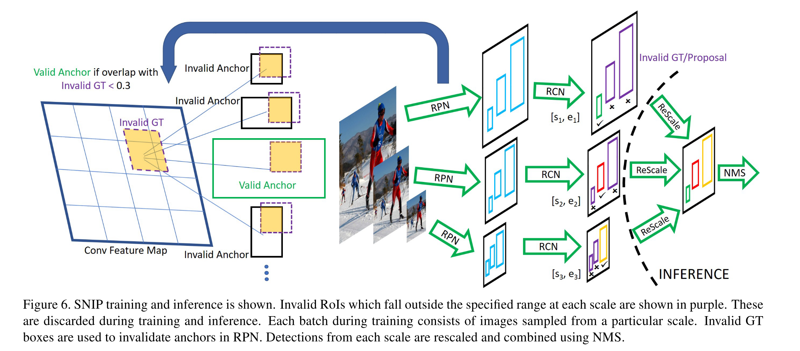

# [An Analysis of Scale Invariance in Object Detection - SNIP](https://arxiv.org/abs/1711.08189)

Tags: task.object_detection  
Date: 11/22/2017

- The authors are motivated to evaluate the performance of object detection networks on small objects and develop an architecture that can overcome some of the challenges in detecting small objects
- The authors propose a training paradigm in which training is only performed on examples that fall in a desired scale range and the remainder of examples are ignored during back-propagation
    - The desired scale range is one that is close to the resolution of the pre-training dataset, e.g. 224 x 224 for networks pre-trained on ImageNet
    - To implement this, they simply do not select proposals and ground truth boxes that are outside a specified size range at a particular resolution during training
- They test their method on MS COCO and obtain SOTA
- Through experimentation / training, they note:
    - Testing networks on resolutions on which the network was not trained is sub-optimal, both for image classification as well as object detection
    - When upsampling COCO images to the standard 1400 x 2000 that test images are usually upsampled to for training, large objects often become too large to be correctly classified
    - Its important to train detectors with appropriately scaled objects while capturing as much variation across the objects as possible
    - SNIP uses all the object instances during training, which helps capture all the variations in appearance and pose, while reducing the domain-shift in the scale-space for the pre-trained networks
    - Multi-scale training significantly outperforms single scale training

## SNIP Training Paradigm

