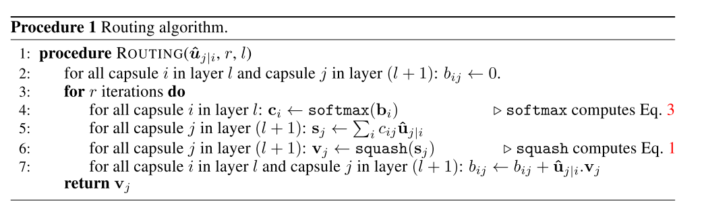

# [Dynamic Routing Between Capsules](https://arxiv.org/abs/1710.09829)

Tags: task.object_classification, topic.capsule_networks  
Date: 10/26/2017  

- The authors are motivated to train a network built around capsules to perform a supervised task
    - A capsule is a group of neurons whose activity vector represents the instantiation parameters of a specific type of entity such as an object or an object part
- They propose a routing-by-agreement mechanism in which a lower-level capsule prefers to send its output to higher level capsules whose activity vectors have a big scalar product with the prediction coming from the lower-level capsule
    - The input to a capsule (for all but the first layer of capsules) is a weighted sum over all the "prediction vectors" in the layer below
        - Each "prediction vector" is produced by multiplying the output of a capsule in the layer below by a weight matrix
        - The coefficients that determine the weight applied to each "prediction vector" is determined by an iterative dynamic routing process
    - The output of a capsule is a vector whose length represents the probability that a given entity exists and its orientation represents the instantiation parameters
        - They use a squashing function to ensure that short vectors get shrunk to almost zero length and long vectors get shrunk to a length slightly below 1 (orientation remains unchanged)
    - They use a shallow network architecture consisting of only two convolutional layers and one fully connected layer, and also add a decoder consisting of 3 fully connected layers to train using an additional reconstruction loss
- They test their method on MNIST, MultiMNIST dataset (overlapping MNIST digits dataset they create), CIFAR10, smallNORB, and SVHN
    - They use a margin loss for digit existence, and allow for multiple digits to be predicted
    - Testing against a baseline CNN with roughly the same number of parameters, they obtain a significantly lower test error rate on MNIST (0.25% with CapsNet compared to 0.39% from the baseline) with fewer parameters (8.2 million for CapsNet versus 35.4 million for the baseline)
    - For MultiMNIST, the CapsNet outperforms the baseline CNN, and achieves the same classification error rate as a sequential attention model on an easier task that has less overlap
    - On CIFAR10, they achieve an error rate similar to what standard convolutional nets achieved when they were first applied (~10.5% error)
    - On smallNORB, they achieve an error rate that is on par with SOTA
- Through training / experimentation, they note:
    - By making use of the decoder network and feeding perturbed versions of the activity vectors into it, they can visualize what the individual dimensions represent
        - One of the dimensions almost always represents the width of the digit
        - Other dimensions represent characteristics like scale & thickness, a localized part of a number (e.g. the length of the ascender of a 6), stroke thickness, and localized skew 
    - A CapsNet trained on a padded and translated MNIST performs significantly better on affNIST (affine MNIST) than a traditional CNN, despite the two having similar performance on the expanded MNIST test set
    - There are fundamental representational reasons for believeing that using capsules is a better approach, but there probably need to be a lot more small insights before capsules can outperform other currently used technologies

## Routing Algorithm

