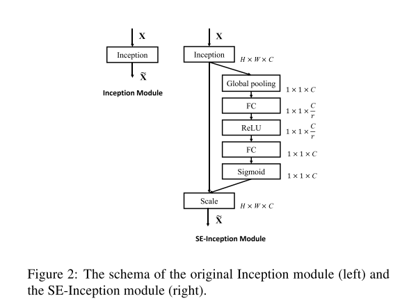
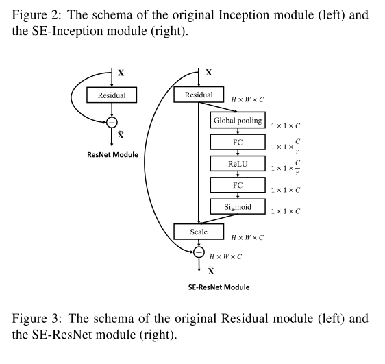

# [Squeeze-and-Excitation Networks](https://arxiv.org/abs/1709.01507)

Date: 9/05/2017  
Tags: task.object_classification, task.object_detection, task.scene_classification

- The authors are motivated to enhance the channel-wise encodings present in convolutional neural networks to improve the representational power of a network
- The authors propose a "Squeeze-and-Excitation" (SE) block, that adaptively recalibrates channel-wise feature responses by explicitly modeling interdependencies between channels
    - These blocks allow the network to perform feature recalibration, through which it can learn to use global information to selectively emphasize informative features and suppress less useful ones
    - The SE block has a simple design and works as follows:
        - The input features are first passed through a *squeeze* operation, which aggregates the feature maps across spatial dimensions to produce a channel descriptor. This global descriptor embeds the global distribution of channel-wise feature responses.
            - This is done through a global average pooling operation, which squeezes global spatial information into a channel descriptor
        - An *excitation* operation is performed, in which sample-specific activations, learned for each channel by a self-gating mechanism based on channel dependence, govern the excitation of each channel
            - This operation needed to be (a) flexible, meaning that it could learn a nonlinear interaction between channels, and (b) able to learn a non-mutually-exclusive relationship such that multiple channels could be emphasized
            - This is done by employing the following operations to the output of the squeeze operation:
                - A fully connected layer with a ReLU activation
                - A fully connected layer with a sigmoid activation
        - Finally, the original input features are reweighted (scaled) by the results of the squeeze and excitation operations to generate the SE blocks
- They test their method on ImageNet classification, COCO object detection, and Places365 scene classification
    - On ImageNet, they achieve SOTA
    - On Places365, they achieve SOTA
    - SE blocks improve the relative performance of their Faster R-CNN implementation by ~2.5% - 5.0%
- Through training / experimentation, they note:
    - Adding SE blocks into ResNet-50 increases the number of GFLOPs by 0.26%, the time for a single forward and backward pass by ~10%, and the number of parameters by ~10%
    - The majority of parameters in an SE block come from the last stage, where excitation is performed across the greatest channel dimensions; these could be removed at a marginal drop in performance (~0.1% top-1 error on ImageNet)
    - SE blocks consistently improve performance across different networks and depths, and the gains are larger for efficient architectures (e.g. MobileNet and ShuffleNet)
    - In looking at the excitation activations, they note:
        - The distribution across different classes is nearly identical in lower layers, suggesting that the importance of feature channels is likely to be shared by different classes in the early stages of the network
        - At greater depths, the values of each channel becomes much more class-specific
        - At the last stage of the network, they see a tendency towards a saturated state

## SE-Inception module

## SE-ResNet module

