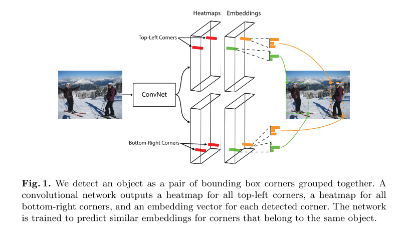
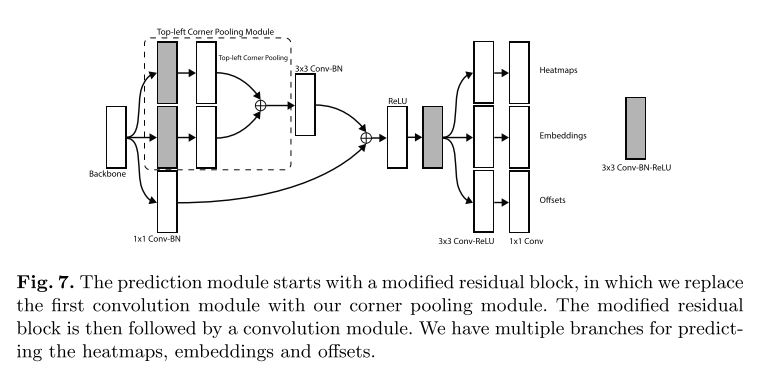
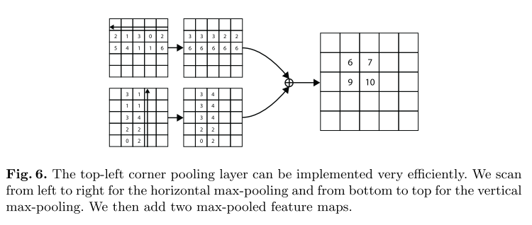

# [CornerNet: Detecting Objects as Paired Keypoints](https://arxiv.org/abs/1808.01244)

Date: 08/03/2018  
Tags: task.object_detection

- The authors are motivated to introduce a one-stage approach for object detection that does away with anchor boxes
    - Anchor boxes have two major drawbacks:
        - We typically have to use a very large set of anchor boxes to acheive good performance, and this creates a huge imbalance between positive and negative anchors
        - The use of anchor boxes introduces many hyperparameters and design choices, including how many boxes to use, what size, and what aspect ratios
- The authors propose CornerNet, in which an object is detected as a pair of keypoints
    - CornerNet is a convolutional network that produces a couple of things:
        - Two sets of heatmaps to represent the locations of corners of different object categories (one for the top-left corners and one for the top-right corners)
            - Each set of heatmaps has C channels, where C is the number of classes, and there is no background class
            - During training, they reduce the penalty given to negative locations within a radius of the positive location; they determine this radius by taking all pairs of points that would produce a bounding box with some minimum IOU with the ground truth annotation
            - They use a variant of focal loss to enforce the penalty on the heatmap predictions
        - An embedding vector for each detected corner
            - The embedding vectors are used to group corners, i.e. if a top-left and bottom-right corner belong to the same bounding box, the distance between their embeddings should be small
            - They use the "pull" loss to train the network to group the corners and the "push" loss to separate the corners
        - Offsets to slightly adjust the locations of the corners
            - They apply a smooth L1 Loss for these predictions
    - CornerNet uses a stacked hourglass network as the backbone, and is followed by two prediction modules for the top-left corners and bottom-right corners
        - They only use the feature from the last layer of the whole network to make predictions
        - Each prediction module has its own corner pooling module to pool features from the stacked hourglass network before predicting the heatmaps, embeddings, and offsets
    - The corner pooling layer takes in two feature maps; at each pixel location it max-pools all feature vectors to the right from the first feature map, max pools all feature vectors directly below from the second feature map, and then adds the two pooled results together
- They evaluate their network on the MS COCO object detection task, and obtain SOTA for single-stage detectors and are very competitive relative to two-stage detectors
- Through training / experimentation, they note
    - The use of corner pooling adds noticeable improvements, on the order of ~2% increases in mAP relative to not using them
    - Reducing the penalty applied to predicted corners within a fixed radius of the ground truth increases mAP by ~1.5 - 5.3% mAP (depending on object size), and using an object-dependent radius further improves mAP by ~2.6% - 6.5% mAP
    - The main bottleneck of CornerNet is detecting corners

## CornerNet Architecture

## Prediction Module

## Corner Pooling

