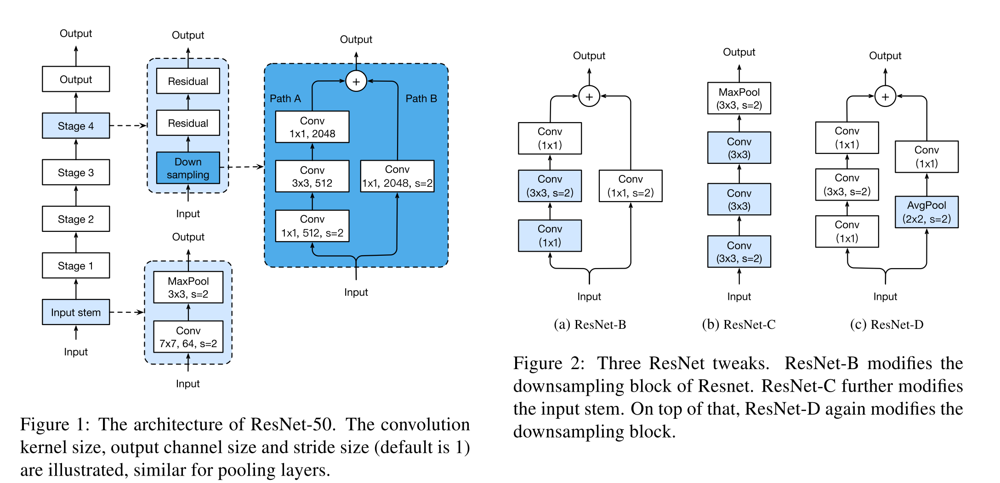

# [Bag of Tricks for Image Classification with Convolutional Neural Networks](https://arxiv.org/abs/1812.01187v2)

Tags: task.object_classification, task.object_detection, task.semantic_segmentation  
Date: 12/04/2018  

- The authors are motivated to share and validate recent training procedure and model architecture refinements ("tricks") that improve performance of image classification networks but barely change computational complexity
    - Over recent years, we have seen a steady trend of model accuracy improvement, but the advancements have come through improvements in model architectures *as well as* training procedure refinements such as changes in loss functions, data preprocessing, and optimization methods. A good number of these refinements, though, are either briefly mentioned as implementation details or only visible in source code
- The authors propose ablation experiments on many of the model architecture and training procedure refinements that have been made over recent years
    - In terms of training, they test various techniques that enable low precision and large batch training without sacrificing model accuracy
        - Large batch training involves several tricks:
            - Linear scaling of learning rate, which consists of linearly increasing the learning rate with the batch size so that we can take larger steps during gradient descent and make larger progress along the direction opposite the gradient
            - Learning rate warmup, which consists of using a small learning rate at the beginning of training and then switching back to the initial learning rate when the training process is stable
            - Zero *gamma*, which consists of initializing *gamma* to zero in the last batch normalization layer of residual blocks in order to mimic a network with fewer layers that is easier to train at the initial stage
            - No bias decay, which applies weight decay regularization to only the weights in the convolution and fully-connected layers, leaving the biases, *gamma* values, and *beta* values of batch normalization layers unregularized
        - Low-precision training consists of storing all parameters and activations in floating point 16 and using floating point 16 to compute gradients, but at the same time having a copy in floating point 32 for parameter updating. It also might involve multiplying a scalar to the loss to better align the range of the gradient into floating point 16.
    - For training, they also test a couple of general training refinements (that aren't necessarily aimed at large minibatch or low-precision training):
        - Cosine learning rate decay, which uses a cosine annealing strategy for the learning rate as opposed to a linear or step decay annealing strategy
        - Label smoothing, which smooths the ground truth labels such that they aren't exactly 0 or 1, which in theory can help prevent sharp decision boundaries and overfitting
        - Knowledge Distillation, which uses a teacher model that has higher accuracy to train a student model
        - Mixup training, which trains using mixup examples (new examples generated as the linear interpolation between two randomly drawn examples)
    - In terms of model changes, they test several tweaks to the ResNet architectures, a number of which are aimed at ensuring that information isn't thrown away needlessly:
        - Changing both paths of the downsampling blocks. For path A (the non-shorcut path), the first convolution is performed using a stride of (1, 1) and the second uses a stride of (2, 2), meaning that the second convolution performs the downsampling, and not the first. For path B (the shorcut path), they change the stride of the convolutional layer to be (1, 1) and then place an average pooling layer before the convolution (2 x 2 average pooling with stride (2, 2))
        - Replacing the 7 x 7 convolution in the input stem of the network to three consecutive 3 x 3 convolutions
- They test their proposed techniques by testing object classification using ImageNet, object detection using PASCAL VOC, and semantic segmentation using ADE20k
    - For object classification using ImageNet, 
        - Using a batch size of 1024 (as opposed to 256) and training with floating point 16 reduces training time for ResNet-50 from 13.3 minutes per epoch to 4.4 minutes per epoch for ImageNet, and even improved top-1 accuracy by 0.5 percentage points and top-5 accuracy by 0.3 percentage points (these accuracy improvements also include the other large mini-batch and low precision training tricks)
        - Using the ResNet tweaks, they achieve a boost of ~1 percentage points in top-1 accuracy and 0.5 percentage points in top-5 accuracy
        - Using cosine decay, label smoothing, and mixup training they achieve a 2 percentage point increase in top-1 accuracy and a 1.1 percentage point increase in top-5 accuracy on ResNet-50 (the differences aren't quite as large for Inception-V3 or MobileNet, but are still noticeable)
    - For object detection using PASCAL VOC, they see that the techniques that yielded better performing models on ImageNet also led to better performing models on PASCAL VOC, and that all techniques lead to better performance in the Faster R-CNN framework
    - For semantic segmentation, they see improvements through using cosine annealing, but nothing else (label smoothing, knowledge distillation, or mixup training)
- Through training / experimentation, they note:
    - Switching from floating point 32 to floating point 16 at the end of training does not affect accuracy
    - Label smoothing, distillation, and mixup favor softer labels, and since semantic segmentation works at the pixel level, these techniques could have led to blurred pixel-level information that ultimately led to the degradation in overall pixel-level accuracy that was seen

## ResNet Tweaks

