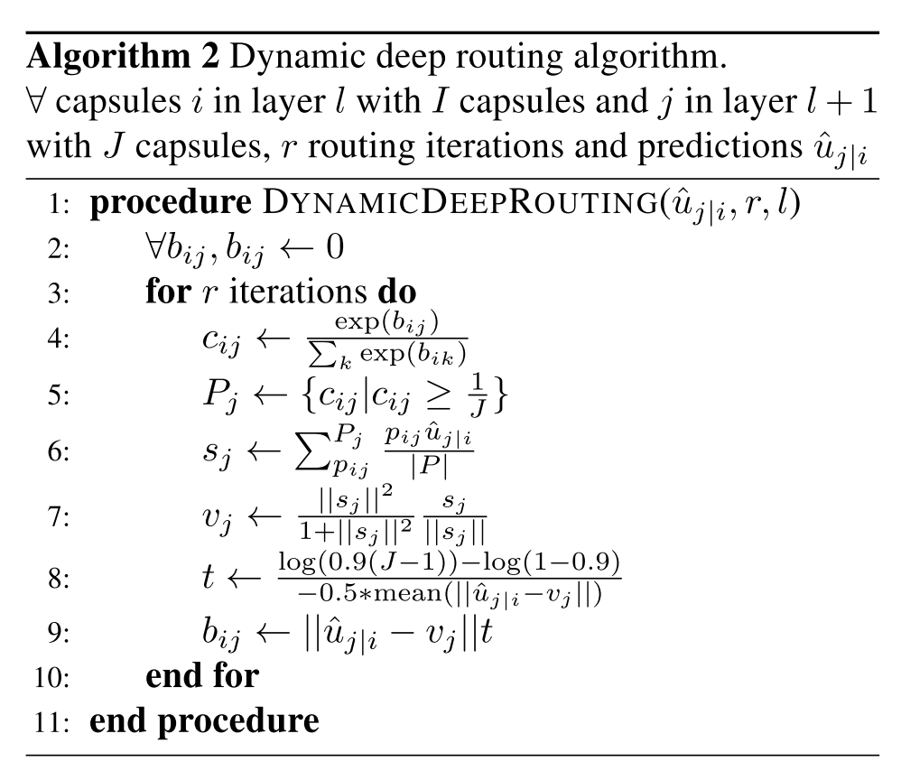

# [Training Deep Capsule Networks](https://arxiv.org/abs/1812.09707)

Tags: task.object_classification, topic.adversarial_attacks, topic.capsule_networks  
Date: 12/23/2018

- The authors are motivated to develop a dynamic routing algorithm that ensures that all active capsules form a parse tree
    - The *routing-by-agreement* algorithm that was previously developed to train capsule networks does not ensure the emergence of a parse tree in the network
    - Any good routing algorithm should have at least two properties:
        - Capsules in a network should represent a node in a parse tree, i.e. a capsule sholud only be coupled to one parent, but one parent can be copuled to multiple children
        - The coupling of lower level capsules with parent capsules should be dynamic, i.e. the parse tree should change with the input
    - To evaluate the presence of these two properties, they propose two metrics:
        - The average maximum coupling coefficient (where the coupling coefficient is between a child and parent capsule)
        - The maximum batch standard deviation: the standard deviation of each lower level capsule for one mini-batch
- The authors propose a *dynamic deep routing* algorithm that satisfies the properties of a good routing algorithm
    - With the goal of ensuring that the distance from the activation vector to parent predictions becoming smaller as the routing proceeds, their algorithm makes the following changes to the *routing-by-agreement* algorithm:
        - They change the calculation of the log prior probability that capsule *i* should be coupled to capsule *j* (i.e. b_ij). Instead of it being a dot product, they replace it with the negative euclidean distance
        - They replace the calculation of the activity vector; instead of using the sum of all weighted predictions for one upper level capsule, they calculate the average of a subset of weighted lower level predictions
- The authors test their proposed method on MNIST, against the *routing-by-agreement* algorithm as a baseline
    - The network using *routing-by-agreement* shows near uniform coupling coefficients (average maximum coupling coefficient of 0.11 spread across 10 output capsules), whereas the *dynamic deep routing* algorithm shows non-uniform coupling (average maximum coupling coefficient of 0.73)
    - The network using *routing-by-agreement* shows low maximum batch standard deviation (0.008), while the network using *dynamic deep routing* shows a much higher maximum batch standard deviation (0.23)
- Through training / experimentation, they note: 
    - The network trained using *dynamic deep routing* produces capsules that form a parse tree
    - Training deeper capsule networks (four hidden layers) is possible using the *dynamic deep routing* algorithm, whereas it isn't possible using the *routing-by-agreement* algorithm
    - A network that uses the *dynamic deep routing* algorithm is less vulnerable to white box adversarial attacks than one that uses *routing-by-agreement*

## Dynamic Deep Routing Algorithm

