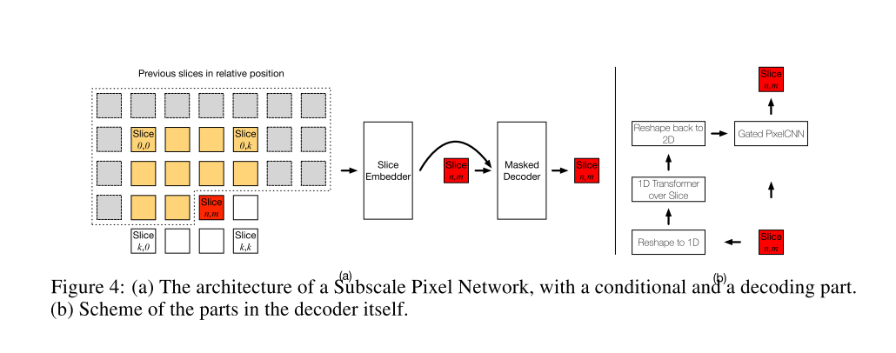
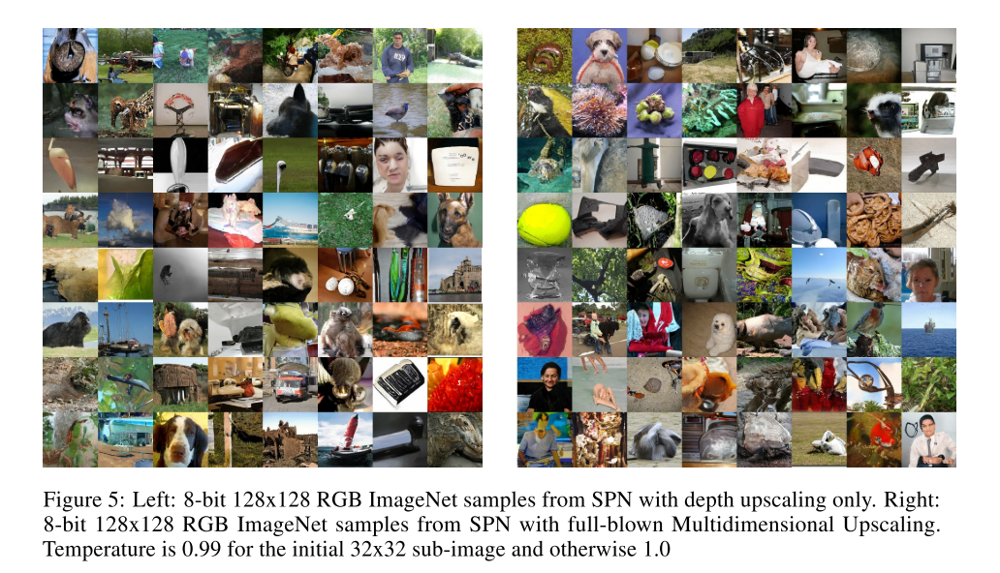

# [Generating High Fidelity Images with Subscale Pixel Networks and Multidimensional Upscaling](https://arxiv.org/abs/1812.01608)

Tags: task.image_generation  
Date: 12/4/2018

- The authors are motivated to generate high fidelity images and tackle two of the major challenges in doing so: (1) the capacity to encode the vast previous context typically used to generate images, and (2) the sheer difficulty of learning a distribution that preserves both global semantic coherence and exactness of detail
    - These challenges are particularly apparent in generating large-scale images, a domain that previous works have failed to perform well in
        - MLE (often used when optimizing to produce high fidelity images) forces the model to support the entire empirical distribution, which guarentees the model's ability to generalize at the cost of allotting capacity to parts of the distribution that are irrelevant to fidelity
- The authors propose using three networks: (a) a decoder on the small size, low depth image slices subsampled at every *n* pixels from the original image with the desired target resolution, (b) a size-upscaling decoder that generates the large size, low depth image, and (c) a depth-upscaling decoder that generates the large size, high depth image 
    - They aim to guide the model to focus first on visually more salient bits of the distribution and later on the visually less salient bits, in the hopes of avoiding the network allotting capacity to parts of the image distribution that are irrelevant to fidelity
        - To map from one subset of the distribution to another (e.g. small size, low depth image slices to large size, low depth images), they use *Multidimensional Upscaling* along the size or depth dimensions
    - To better equip the network to learn a distribution that preserves both global semantic coherence and exactness of detail, they develop the *Subscale Pixel Network* (SPN) to use in the decoders of (b) and (c)
        - The SPN divides an image of size NxN into sub-images of size N/S x N/S sliced out at interleaving positions.
        - It consists of two networks, a conditioning network that embeds previous slices and a decoder that predicts a single target slice from the context embedding (the NxN image is generated one slice at a time)
- They test their proposed method on CelebAHQ-256 and on ImageNet-64, as well as establishing MLE baselines for ImageNet-128 and ImageNet-256
    - On ImageNet-64, they achieve a state of the art log-likelihood (and improve significantly upon Glow)
    - On CelebAHQ-256, their results compare favorably to other models such as Glow and GAN
- Through training / experimentation, they note that the generated samples show an unprecedented amount of semantic coherence and exactness of detail even at the large scale size of full 8-bit 128 x 128 and 256 x 256 images

## Subscale Pixel Network

## Example High Fidelity Images

