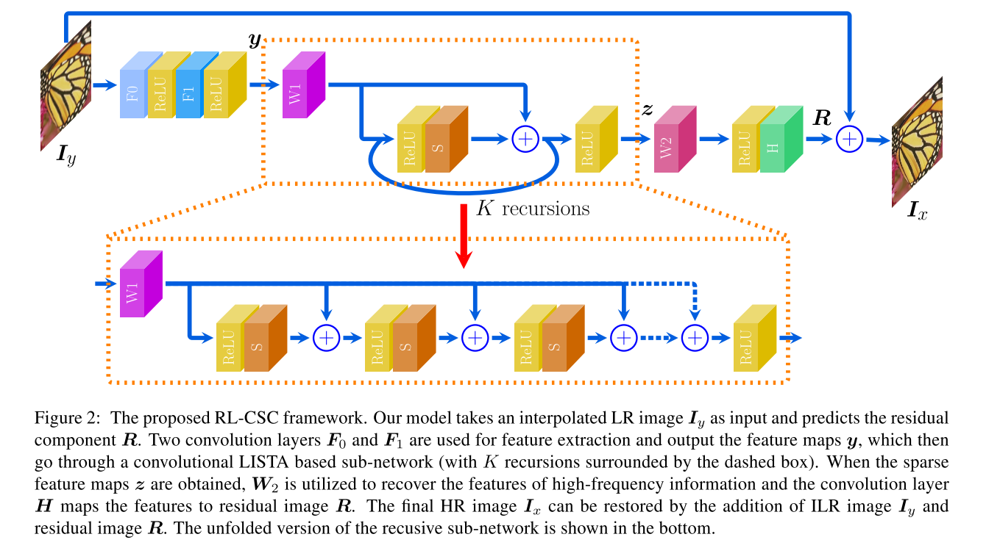

# [Image Super-Resolution via RL-CSC: When Residual Learning Meets Convolutional Sparse Coding](https://arxiv.org/abs/1812.11950v1)

Tags: task.image_super_resolution  
Date: 12/31/2018  

- The authors are motivated to develop a simple yet effective model for Single Image Super-Resolution (SISR)
- The authors propose a network that combines the merits of Residual Learning and Convolutional Sparse Coding (RL-CSC) and extends the Learned Iterative Shrinkage-Threshold Algorithm (LISTA) to its convolutional version
    - There are 6 trainable layers in their model: two convolutional layers for feature extraction, two convolutional layers for learning a convolutional sparse coding, and two convolutional layers for learning residual image reconstruction
    - The two convolutional layers that are responsible for learning a convolutional sparse coding are learned through a recursive process
- They test their method on a number of datasets, and specifically mention BSD100 (Berkely Segmentation Dataset) and Urban100
    - They measure Peak Signal-to-Noise Ratio (PSNR) and the Structural SIMilarity (SSIM) on the Y channel (i.e. the luminance channel)
    - They set SOTA on all datasets and all metrics
- Through training / experimentation, they note:
    - Their method tends to produce sharper edges and more correct textures, while others tend to produce images that may be blurred or distorted
    - A higher number of recursions (which leads to a deeper model) leads to better results
    - Residual learning is critical; without it their networks cannot converge
    - Since their algorithm is derived from LISTA, it has inherently good interpretability

## Network Architecture

