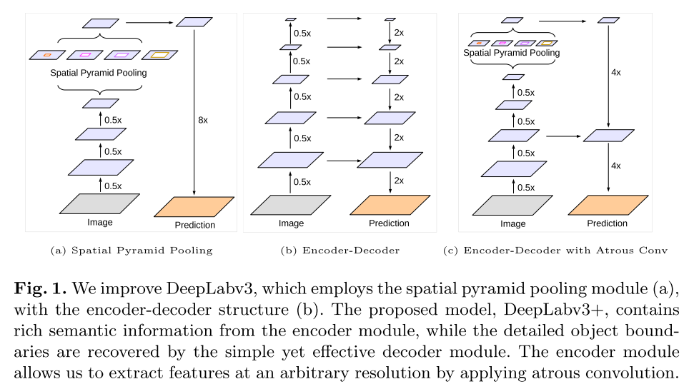
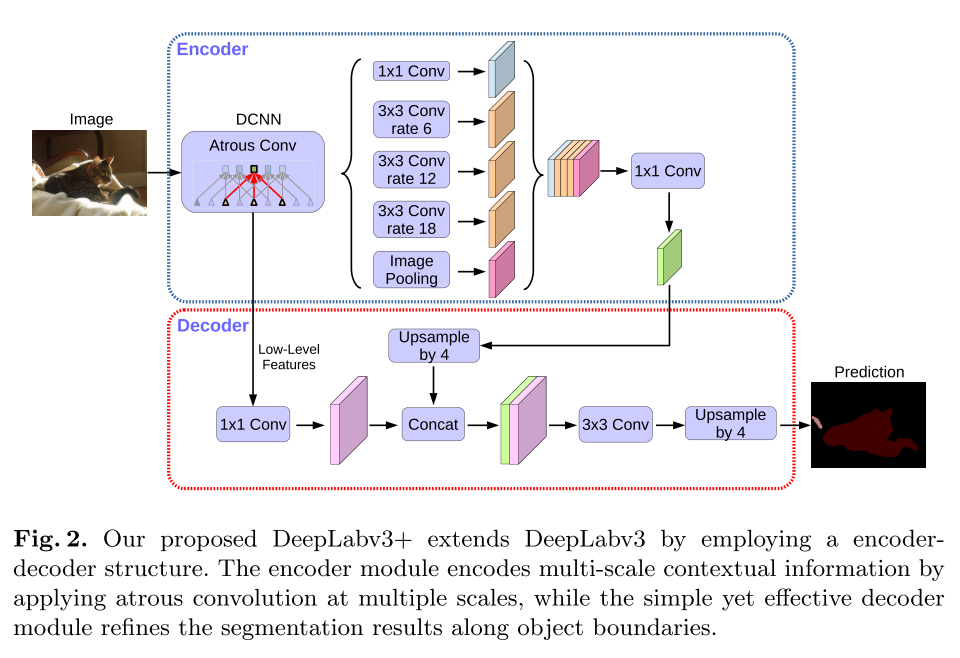
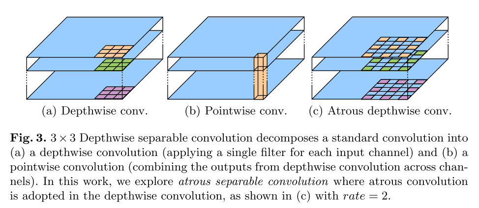

# [Encoder-Decoder with Atrous Separable Convolution for Semantic Image Segmentation](https://arxiv.org/abs/1802.02611)

Tags: task.semantic_segmentation  
Date: 02/07/2018

- The authors are motivated to combine the advantages of spatial pyramid pooling modules as well as encoder-decoder structures that are used for semantic segmentation tasks
    - Spatial pyramid pooling networks are able to encode multi-scale contextual information by probing the incoming features with filters or pooling operations at multiple rates and multiple effective fields-of-view
        - Using atrous convolutions at early stages of the network (i.e. when the resolution is only 4x or 8x smaller than the input) is computationally prohibitive. Doing it at later stages of the network (i.e. when the resolution is 16x smaller than the input, or more) means throwing away detailed information related to object boundaries
    - Encoder-decoder network structures can capture sharper object boundaries by gradually recovering spatial information lost in the encoding part of the network
- The authors propose a network that uses spatial pyramid pooling in the encoder module, but adds on a simple decoder that is inspired by the decoders used in encoder-decoder network structures (i.e. DeepLab V3+)
    - The authors use the DeepLab V3 module as the encoder, experimenting with implementations based off the Aligned Xception model and ResNet101. The encoders use several downsampling blocks followed by atrous convolutions of differing rates to form a spatial pyramid pooling module.
        - For image classification, an output stride of 32 is common (i.e. the final resolution is 32x smaller than the input), but for semantic segmentation an output stride of 8 or 16 is more common.
        - To the Aligned Xception network, they make a few changes:
            - They make it deeper
            - They experiment with replacing max pooling operations with atrous separable convolutions
            - They add extra batch normalization and ReLU operations after each 3x3 depthwise convolution (similar to MobileNet)
        - The encoder networks are pre-trained on ImageNet-1k
    - The authors create a simple decoder:
        - The final encoder features are first bilinearly upsampled by a factor of 4.
        - The usampled features are then concatenated with the low-level features from the ealier stage of the encoder network with the same spatial resolution, *after* a 1x1 conv is applied to the low-level features for channel reduction
        - The concatenated features are run through a few more 3x3 convolutions
        - The features are upsampled by a factor of 4 to produce the final predictions
- The authors test the proposed method on PASCAL VOC 2012 and Cityscapes
    - For PASCAL VOC 2012, when using ResNet101 as the backbone and relative to a simple baseline of simply upsampling the encoder features, the proposed network (with the more intricate decoder) produces noticeable improvements (with output strides of 8, 16, and 32), at the cost of about 20 billion additional multiply-adds
    - On Cityscapes, they set SOTA
- Through training / experimentation, they note:
    - When using ResNet101 as the backbone, reducing the number of channels of the low-level features via the 1x1 conv before concatenating them with the upsampled encoder features (i.e. in the decoding part of the network) does improve performance a bit
    - When using ResNet101 as the backbone, playing around with the order of the 3x3 convolutions that are applied to the concatenated features does not show significant improvement
    - Using an Xception network as the backbone improves the performance relative to ResNet101 (by about ~2 percentage points)
    - When using an Xception network as the backbone, using depthwise separable convolutions in the spatial pyramid pooling and decoder modules reduces the complexity (in terms of multiply-adds) by 33-41%, while still showing similar mIOU performance
    - The proposed decoder shows significant mIOU improvements for pixels that have "void" label annotations (these label typically appear near object boundaries)

## DeepLab V3+ Network Architecture

## Atrous Separable Convolution

