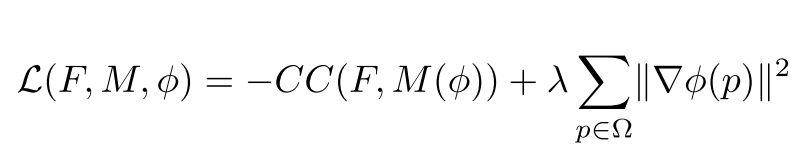
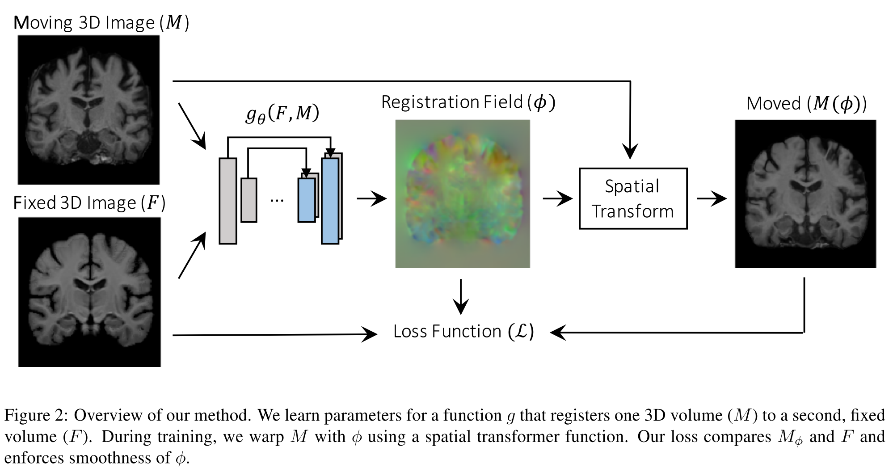

# [An Unsupervised Learning Model for Deformable Medical Image Registration](https://arxiv.org/abs/1802.02604)

Date: 2/18/2018  
Tags: task.image_registration, domain.medical, topic.unsupervised_learning

- The authors are motivated to develop an image registration method that learns a parametrized registration *function* from a collection of volumes. Effectively, they want to replace traditional registration, which is a costly optimization process that works on each pair of test images (i.e. has to be performed for each set of inputs at test time), with the optimization of a single global function learned during a training phase.
- The authors propose using a convolutional neural network in an unsupervised manner to learn a parametrized registration function
    - The convolutional network takes as input two 3D images, a *fixed* and a *moving* image, and produces a registration field that is then applied to register the moving image to the fixed image
        - The fixed and moving images are affinely aligned as a preprocessing step
    - The convolutional network they propose is similar to UNet, consisting of an encoder-decoder with skip connections
    - The registration field is applied to the moving image via a spatial transformation using trilinear interpolation, allowing for the use of standard gradient-based methods (i.e. backpropagation)
    - They minimize a similarity based loss function with an added regularization term applied to the smoothness of the produced registration field
        - The similarity function that they use is the negative local cross-correlation because it is robust to intensity variations that might be found between the fixed and moving images
        - The regularization that is applied is based off the spatial gradients of the registration field

- They test the proposed method using brain MRI scans for registration, combined from 7 publicly available datasets
    - They focus on atlas-based registration, in which a registration field is computed between an atlas, or reference volume, and each volume in the dataset
    - They evaluate their method using volume overlap of anatomical segmentations, comparing the dice scores for their method versus more traditional methods (ANTs) that they set as the baseline
    - Their method, VoxelMorph, performs comparably to the more traditional methods and significantly outperforms a baseline of affine registration only (as do the more traditional methods). It runs *in under a second* on a GPU, and is ~60-160 times faster than ANTs when run on the CPU (there is no GPU implementation of ANTs)
- Through training / experimentation, they note: 
    - The model is relatively robust to the choice of the smoothing parameter

## VoxelMorph Architecture

