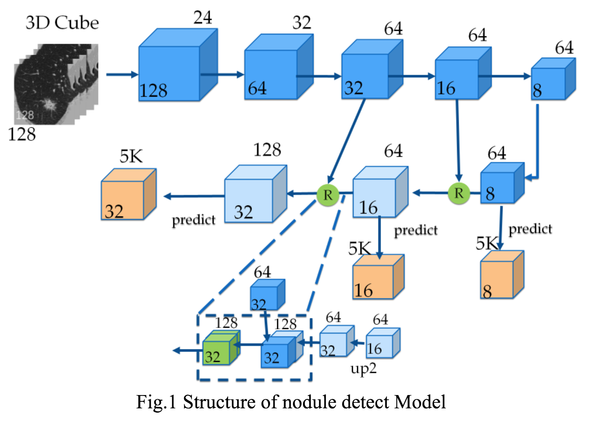

# [3DCNN for Lung Nodule Detection  And False Positive Reduction](http://luna16.grand-challenge.org/serve/public_html/pdfs/20180102_081812_PAtech_NDET.pdf/)

Date: 01/02/2018  
Tags: task.object_detection, task.object_classification, domain.medical

- The authors are motivated to design a state-of-the-art nodule detection system
- They propose a two stage system that consists of the following parts:
    - Nodule Candidate Detection System: To propose nodule candidates, they use a U-Net style architecture that acts as a feature pyramid network (FPN).
        - The inputs to the network are cuboid patches cropped from the lung (using "traditional methods" to get the lung area), and it's unclear what the outputs are. The visuals suggest 3D patches that are smaller than the input.
        - They mention using focal loss on the classification subnet when discussing this section of the paper, but it's not super clear how it works.
    - False Positive Reduction network: They use a 3D U-Net model for nodule classification as a true nodule or false positive. Details are sparse and hard to understand here, but they do say that this network shares features with the Nodule Candidate Detection System network.
- They test their proposed method on the LUNA challenge, and were at the top of the leaderboard at the time of writing, with an average FROC of 0.951

## Nodule Candidate Detection Network

## False Positive Reduction Network

