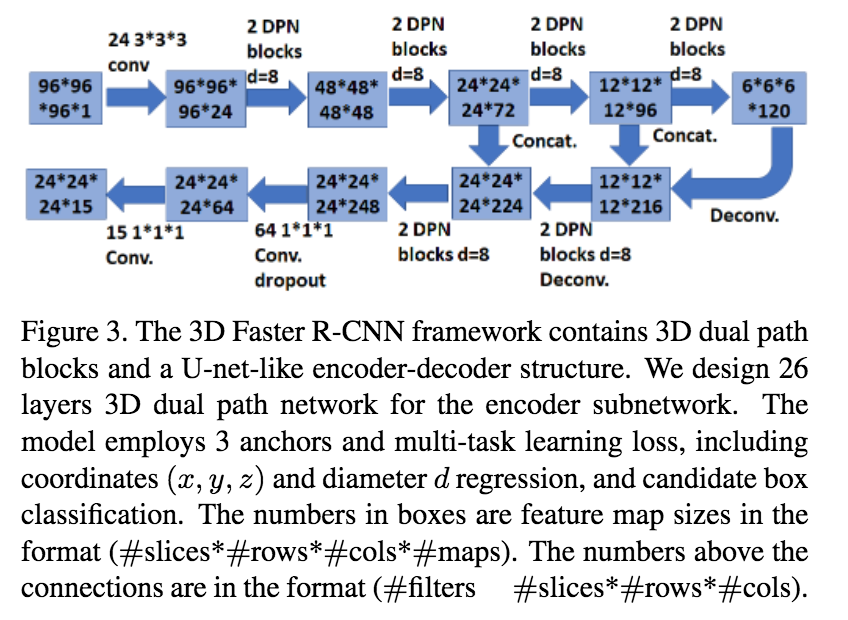
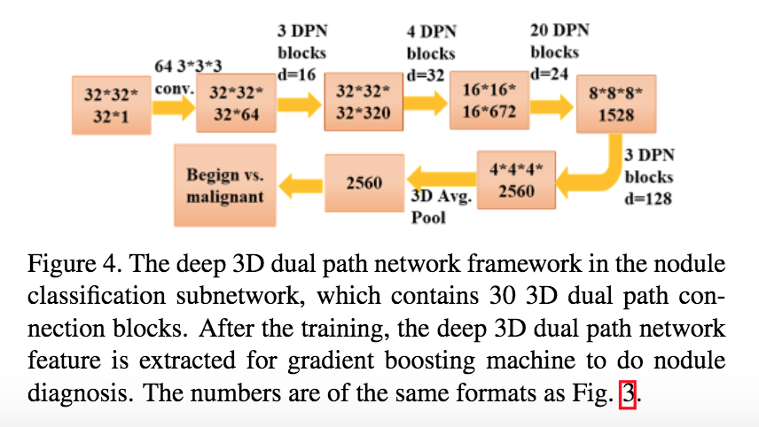

# [DeepLung: Deep 3D Dual Path Nets for Automated Pulmonary Nodule Detection and Classification](https://arxiv.org/abs/1801.09555)

Date: 01/25/2018  
Tags: task.object_detection, task.object_classification, domain.medical

- The authors are motivated to develop a fully automated lung CT cancer diagnosis system
- The authors propose DeepLung, a system that consists of two components:
    1. Nodule detection: This is performed using a 3D implementation of Faster R-CNN that is U-Net like in structure (i.e. has an encoder-decoder structure) and uses dual path connections throughout.
        - The input is a 3D patch from a lung CT (they use 96x96x96) and the output is a nodule classification along with an (x, y, z) center point and diameter measurement
        - They use three anchors which they base on the distribution of nodule sizes
        - For each anchor, the loss function consists of two parts: a classification loss (binary cross entropy) for whether the current box is a nodule or not, and a regression loss (Smooth L1) over the nodule coordinates (x, y, z) and nodule size (diameter)
        - They keep all boxes that have a probability higher than 0.12, and use non-maximum supression to combine duplicate nodules (using an IoU threshold of 0.1)
    2. Nodule classification: This is performed using a 3D convolutional network that also uses dual path connections throughout, along with gradient boosted trees that perform classification on the features of the CNN (along with the nodule size and raw 3D cropped pixels).
        - The input is a 3D patch of a detected nodule and the output is a classification score for whether the nodule is malignant or benign
        - This is done in a separate step from nodule detection because classification requires a system to learn finer-level features
- They test their proposed method on the LUNA challenge dataset
    - For nodule detection, they achieve an average FROC of 84.2%. This is lower than many other submissions, but it doesn't use a false positive reduction network like many other submissions.
    - For nodule level classification, they achieve an average accuracy of 92.74% (averaged over comparing to the 4 annotators of LUNA), compared to an average of 91.25% over the four annotators
        - Their average accuracy (in general) is 90.44%
    - For patient level diagnosis accuracy (i.e. if patient has one cancerous nodule they're labeled cancerous), they achieve an average accuracy of 81.41%  (averaged over comparing to the 4 annotators of LUNA), compared to an average of 82.31% over the four annotators
- Through their experiments, they note:
    - Using the dual path connections outperforms using residual connections alone

## Nodule Detection

## Nodule Classification

