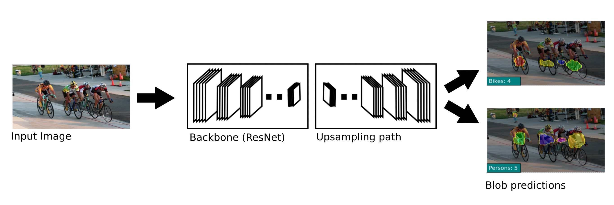

# [Where are the Blobs: Counting by Localization with Point Supervision](https://arxiv.org/abs/1807.09856)

Date: 07/25/2018
Tags: task.object_counting

- The authors are motivated to develop a detection-based method for object counting that does not need to estimate the size and shape of the objects
    - Most state of the art methods for object counting use regression-based optimization, as opposed to detection-based methods that need to learn the more difficult task of predicting the location, size, and shape of each object
- The authors propose a novel loss function on top of a fully convolutional network that encourages the network to provide rough estimates of object locations, but not their sizes or shapes
    - The novel loss function enforces a network to predict semantic segmentation labels for each pixel in the image, and to output a segmentation blob for each object instance. The number of objects is simply the number of blobs.
    - The loss function only requires point-level annotations that indicate the location of each object, and consists of four distinct terms:
        - Image-level loss: For each class in the image, it increases the probability that the model labels at least one pixel as that class. For each class not in the image, it decreases the probability that the model labels any pixel as that class.
        - Point-level loss: This encourages the model to correctly label the small set of supervised pixels contained in the ground-truth.
        - Split-level loss: This loss discourages the model from predicting blobs that have two or more point-annotations. If a blob has n point annotations, this loss enforces it to be split into n blobs, each corresponding to a unique object.
            - They consider a line split method as well as a watershed split method.
        - False positive loss: This discourages the model from predicting a blob with no point annotations, in order to reduce the number of false positive predictions
- They test the proposed method on a number of datasets:
    - PASCAL VOC 2007, where they set a new SOTA
    - Penguins dataset, where they set a new SOTA
    - Trancos dataset (counting vehicles), where they set a new SOTA
    - Parking lot dataset (counting parked cars), where they set new SOTA
    - MIT traffic, where they set new SOTA
    - Crowd counting datasets, where their method achieves competitive performance
- Through training / experimentation, they note:
    - Using only the image level and point level losses often results in predictions with a single blob that groups many object instances together
    - Using the image level, point level, and split level losses results in predictions of several blobs as object instances, rather than one large single blob as is the case if the split level loss is excluded. However, it results in many blobs that are false positives, since the false positive loss component is not included.
    - Use of the watershed split method, as opposed to the line split method, achieves better performance.

## Network Architecture

