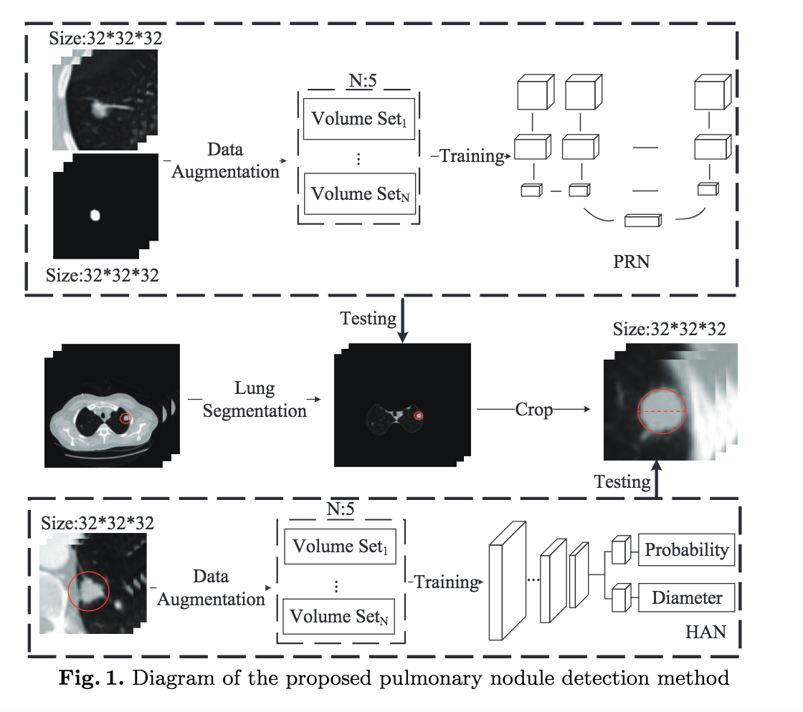
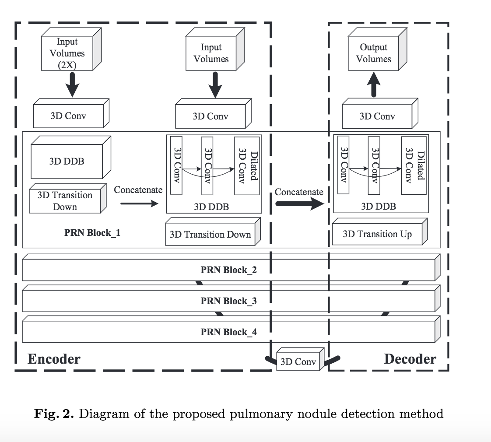
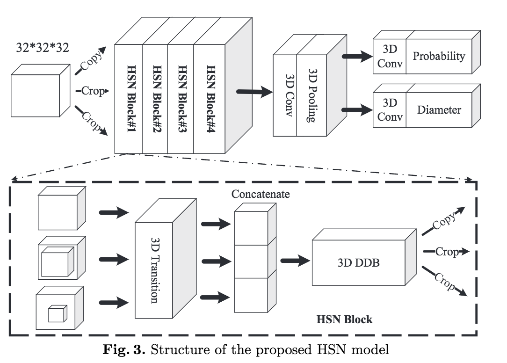

# [A Pulmonary Nodule Detection Model Based on Progressive Resolution and Hierarchical Saliency](https://arxiv.org/abs/1807.00598)

Date: 07/02/2018  
Tags: task.object_detection, domain.medical

- The authors are motivated to develop a state-of-the-art nodule detection algorithm
- The authors propose a three stage process that consists of the following parts:
    1. Lung Segmentation: Using the OTSU algorithm on a slice by slice basis followed by morphological operations, they segment the lung so that they can mask out non-lung areas for the following two stages.
    2. Progressive Resolution Network (PRN): To detect nodule candidates, they propose a U-Net like network that consists of densely dilated blocks (DDB) and outputs segmentation volumes. These segmentation volumes are binarized (using a threshold of 0.8) and connected volumes are sent to the next stage.
        - The inputs to this network are (a) A 32x32x32 patch extracted from within the lung and (b) an upsampled version of that same patch, i.e. a 64x64x64 patch. The output is a 3D volumetric segmentation map for the input.
        - The densely dilated blocks are similar to the dense blocks from the Densely Connected Convolutional Networks paper, where each layer is connected to every other layer
    3. Hierarchical Saliency Network (HSN): To classify nodules as true nodules or false positives, they use a 3D CNN that consists of hierarchical saliency blocks
        - The inputs to this network are 3 different sized crops around nodules of interest, where the crops are then resized to all be the same size. The outputs are a classification probability and a diameter prediction, where the results from the 3 crops are averaged.
        - Inside the HSN blocks, each crop is run through a 3D transition layer, where the results are then concatenated and run through a densely dilated block before then being re-formulated back to 3 new inputs (copy plus 2 crops) to pass to the next HSN block
- They test their proposed method on the LUNA challenge dataset, and achieve SOTA (at the time of publishing) by getting an average FROC of 0.958
    - They also achieve an average difference of 1.34mm between the detected diameter and true diameter

## Nodule Detection Architecture

## Progressive Resolution Network

## Hierarchical Saliency Network

