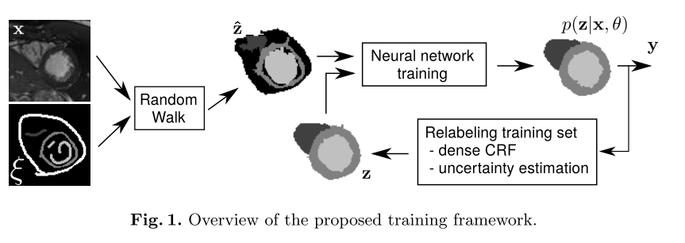

# [Learning To Segment Medical Images with Scribble-Supervision Alone](https://arxiv.org/abs/1807.04668)

Date: 07/12/2018  
Tags: task.semantic_segmentation, domain.medical, topic.weak_supervision

- The authors are motivated to train a medical image segmentation network with weak annotations, namely scribble annotations
    - Particularly in the medical domain, it is difficult to obtain large scale, fully annotated data since it requires an expert to spend considerable time and effort
- They present a scribble-based weakly-supervised learning framework for medical images
    - The scribble annotations are simply ground truth annotations for a very small number of pixels (i.e. from a scribble)
    - The proposed framework is an iterative two-step procedure in which a segmentation network is trained on the scribble annotations, and the result of this network is used in conjunction with a conditional random field (CRF) to relabel the training set, which is in turn used for an additional training *recursion*
        - For the input to the segmentation network, they take the scribble annotations and run them through a random-walk based segmentation method 
        - They use a modified U-Net network as the segmentation network
        - For the conditional random field step, they experiment with dense, fully connected conditional random fields as well as conditional random fields formulated as recurrent neural networks
        - In between recursion steps, they relabel pixel predictions as "uncertain" if it was not predicted with sufficient certainty, gauged by performing 50 forward passes and running t-tests on the softmax distributions produced
- They evaluate their method on two public datasets - the ACDC cardiac segmentation challenge data and the NCI-ISBI prostate segmentation challenge data. Overall, they see only a small degradation in dice compared to the fully supervised network - 2.9% for the cardiac segmentation and 4.5% for prostate segmentation.
- Through training / experimentation, they note: 
    - Using the recursive training strategy led to improvements relative to not using it
    - Using the re-labeling of uncertain pixels helped quite a bit, and helped more than any other single component (CRF, recursive training)
    - Using a CRF led to small improvements
    - *Most* of these notes are most readily seen in looking at the results on the prostate dataset

## Scribble-based Weakly Supervised Learning Framework

