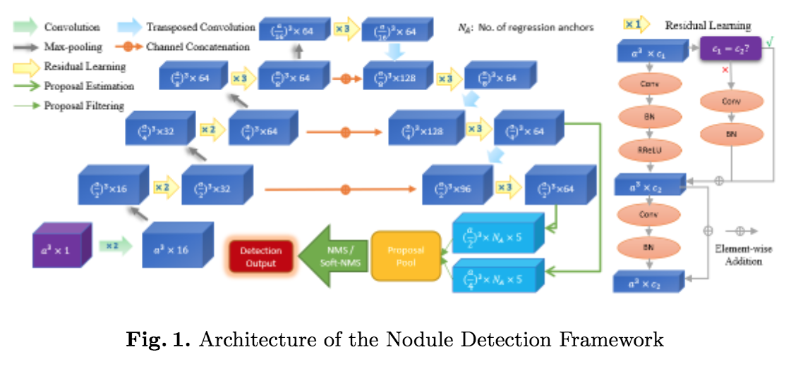

# [Towards Single-phase Single-stage Detection of Pulmonary Nodules in Chest CT Imaging](https://arxiv.org/abs/1807.05972)

Date: 07/16/2018  
Tags: task.object_detection, domain.medical

- The authors are motivated to train a single network to achieve end-to-end nodule detection as opposed to the more conventional multi-stage frameworks that currently exist
    - Training multiple networks introduces considerable engineering effort and also neglects that the two stages are highly correlated in nature (and would benefit from end-to-end training)
    - The multi-stage frameworks where the subnetworks perform similar tasks (binary classification score and bounding box regression) are to some extent redundant
- The authors propose a nodule detection framework that uses a U-Net style network to create a feature pyramid to predict the likelihood of nodules along with center points ((x, y, z) coordinates) as well as diameter
    - The input to the network is a 3D patch cropped around an anchor, and the output is a (a) classification score for the likelihood of a nodule in that patch, (b) the center point (x, y, z) of the nodule, and (c) the diameter of the nodule
    - Training samples are generated by sampling a patch around each anchor on the grid, and are labeled as positive if it overlaps the ground truth over some IoU threshold, and otherwise negative. They use 10 different anchor sizes ((3, 5, 7, 10, 13, 17, 22, 30, 40) millimeters).
    - Initial anchors are set to the locations of ground truth nodules, and are updated after each round of training to include some sets of FP detections (they update them after every 100 epochs when training)
    - They use combined loss function that includes a cross entropy loss for classification and smooth L1 regression loss for the centerpoint and diameter
- They evaluate their proposed method on the LUNA challenge dataset, and achieve an average FROC of 0.9351 (setting SOTA at the time of writing)
- Through experimentation, they note:
    - Without updating the anchors after some number of training rounds, the same model scored an average FROC of 0.9207 (~1.5% worse)
    - Training without anchors (i.e. on full-sized images) was unsuccessful because it would not fit in GPU memory
- In talking to clinicians, they note that the clinicians are generally more tolerant to several false positives in a scan, and propose a new average FROC that only averages over [1, 2, 4] false positives per scan, instead of over the 7 false positive operating points that the LUNA challenge averages over

## Nodule Detection Architecture

