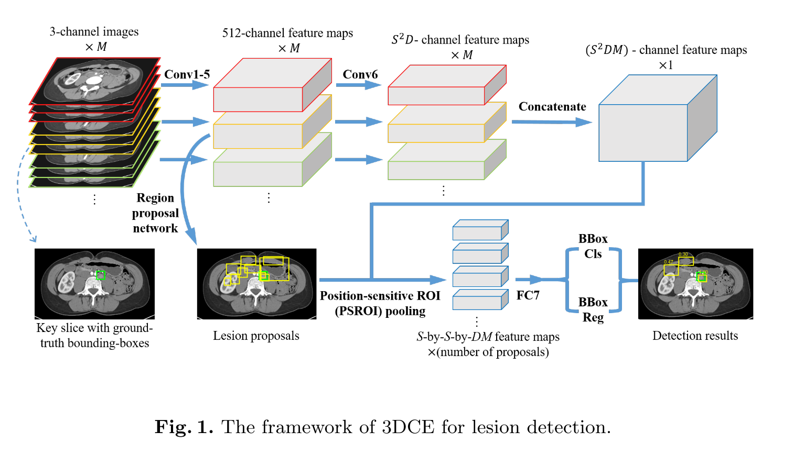

# [3D Context Enhanced Region-based Convolutional Neural Network for End-to-End Lesion Detection](https://arxiv.org/abs/1806.09648)

Date: 06/25/2018  
Tags: task.object_detection, domain.medical  

- The authors are motivated to introduce 3D context into lesion detection
    - Existing end-to-end detection frameworks are mostly designed for 2D images, and 3D context is crucial in differentiating lesions from non-lesions
- The authors propose 3D context enhanced region-based CNNs (3DCE) that incorporate 3D context into 2D regional CNNs
    - Multiple neighboring slices to the slice of interest are sent into the 2D detection network
    - The network is a variant of the region-based fully convolutional network (R-FCN). They tested variants of Faster R-CNN as well, but in initial experiments R-FCN outperformed Faster R-CNN, and also ran more quickly.
    - There are four loss terms in 3DCE: lesion classification loss and bounding-box regression loss in both the region proposal network as well as the region-based fully convolutional network.
- The authors test their proposed method using the DeepLesion dataset
    - Lesion detection sensitivity at 4 false positives per image improved from 80.32% (using the Faster R-CNN variant) to 84.37% (using a 3DCE that uses 27 slices of context)
- Through training / experimentation, they note:
    - Lung, mediastinum, and liver lesions have high sensitivity, likely because of their intensity and relatively high differentiation from the surrounding organs
    - Smaller lesions (< 10mm) showed the greatest relative improvement with their method, as did lesions from scans with finer slice intervals

# 3D Context Enhanced Region-based Convolutional Neural Network

