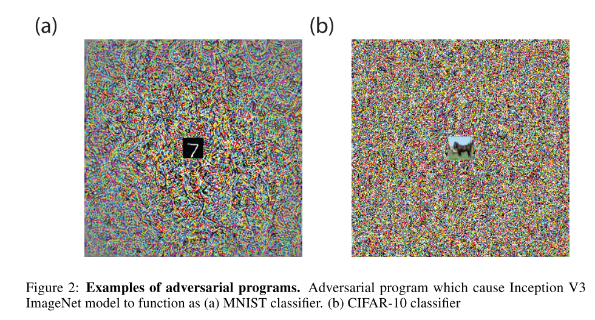

# [Adversarial Reprogramming of Neural Networks](https://arxiv.org/abs/1806.11146)

Tags: task.classification, topic.adversarial_attacks  
Date: 06/28/2018

- The authors are motivated to demonstrate the possibility of an adversarial attack that reprograms a target model to perform a task chosen by the attacker
    - Previous adversarial attacks have only been designed to degrade performance of models or cause them to produce specific outputs chosen ahead of time by the attacker
    - *Untargeted attacks* occur when the adversary succeeds when causing any mistake at all, and *targeted attacks* occur when the adversary succeeds when causing the model to predict a specific incorrect class
- The authors propose a method of learning an *adversarial program*, i.e. where a target model is repurposed to perform a new task
    - The adversarial program is formulated as an additive contribution to the network input, and is a function of learned weights
    - They note that adversarial reprogramming must exploit nonlinear behavior of the target model (provided that it has nonlinear interactions, as nonlinear deep networks do)
- They test their method by building adversarial programs to alter different networks (Inception, ResNet, etc.) from performing ImageNet classification to:
    - Counting squares in an image: The adversarial program masters this counting task for all networks.
    - Classifying MNIST digits: The results show that ImageNet networks can be successfully reprogrammed to function as an MNIST classifier by presenting an additive adversarial program.
    - Classifying CIFAR-10 images: The results show that the adversarial program was able to increase the accuracy of CIFAR-10 from chance to moderate accuracy.
- Through training / experimentation, they note: 
    - An Inception V3 model that was trained on ImageNet data using adversarial training is still vulnerable to reprogramming, with only a slight reduction in attack success
    - Adversarial reprogramming is still successful (albeit with lower accuracy) even with nearly imperceptible programs, i.e. those constrained in size (number of program pixels) and scale (magnitude of perturbations)
    - Trained neural networks were more susceptible to adversarial reprogramming than random networks
    - Reprogramming is still successful even when data structure is very different from the structure of the data in the original task

## Examples of Adversarial Programs

## Examples of Concealed Adversarial Programs

