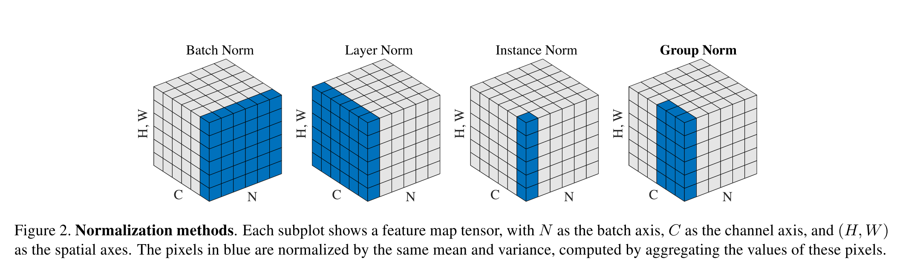
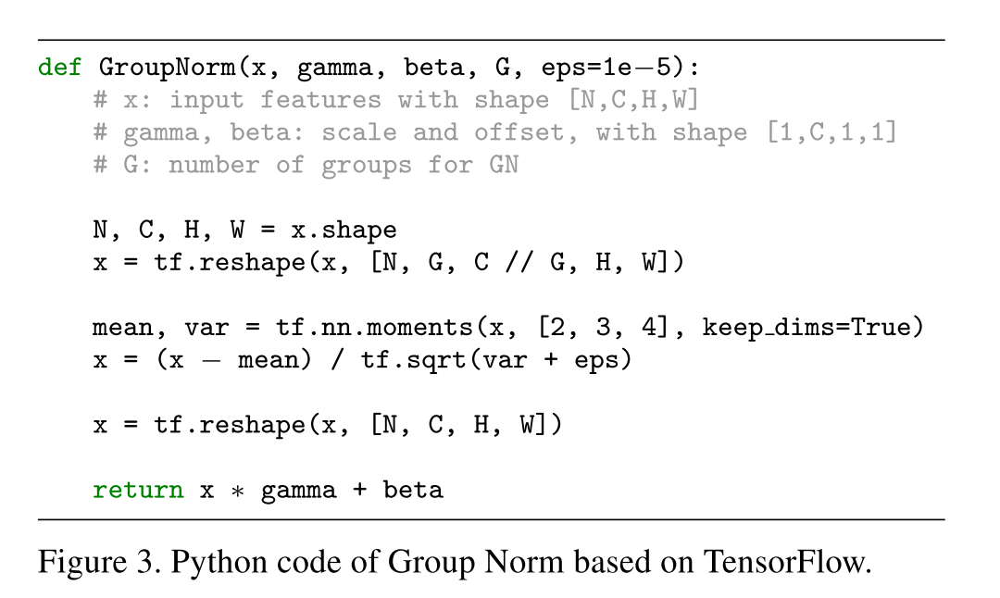

# [Group Normalization](https://arxiv.org/abs/1803.08494)

Tags: task.instance_segmentation, task.object_classification, task.object_detection, task.video_classification  
Date: 03/22/2018  

- The authors are motivated to propose a new normalization strategy that avoids some of the problems that arise when using batch normalization, allowing for a normalization strategy that can be used in tasks where batch sizes are typically pretty small
    - Since batch normalization normalizes along the batch dimension, its error increases rapidly when the batch size becomes smaller, caused by inaccurate batch statistics estimation. This in particular limits batch normalizations use in training larger models and transferring features to computer vision tasks including detection, segmentation, and video, which require small batches constrained by memory consumption.
    - The heavy reliance on batch normalization to train models also prohibits people from exploring higher-capacity models that would be limited by memory
- The authors propose group normalization (GN) as an alternative to batch normalization
    - Group normalization divides the channels of the input into groups and computes within each group the mean and variance for normalization
    - This was in part motivated by noticing that many classical features like SIFT and HOG are *group-wise* features and involve *group-wise* normalization
    - Group normalization does not exploit the batch dimension, and its computation is independent of batch sizes
- They test their proposed approach on ImageNet object classification, as well as object detection and instance segmentation using MS COCO, and video classification using Kinetics
    - When testing with ImageNet, they use ResNet-50 and observe:
        - In the regime where batch normalization works well, group normalization is able to approach batch normalization's accuracy with only a slight degradation in performance. In addition, it outperforms other normalization variants (i.e. layer and instance normalization).
        - With smaller batch sizes (e.g. 16, 8, 4, and 2), batch normalization's error becomes considerably higher, but group normalization's behavior is more stable and insensitive to batch size. In fact, group normalization has very similar error curves across a wide range of batch sizes, from 2 to 32.
    - When testing with MS COCO, they use Mask R-CNN and mainly focus on pretraining / fine-tuning. They observe:
        - When comparing to a network that is pretrained using BN but where the BN layers are frozen during fine-tuning, a pretrained network that uses GN and then continues to train GN during fine-tuning (rather than freezing it) performs better
        - Including GN in the heads of the network further improves performance
    - On the Kinetics dataset, they observe:
        - Group normalization is competitive with batch normalization when batch normalization works well, whereas for small batch sizes group normalization's performance stays relatively constant but batch normalization's degrades (leaving group normalization to perform better)
        - When increasing the temporal size of the batches (which means decreasing the batch size), they see an improvement in performance when using group normalization (as expected), but see no improvement when using batch normalization because the smaller batch size cancels out the performance improvement of increasing the temporal size
- Through training / experimentation, they note:
    - Group normalization becomes layer normalization if we set the group number equal to 1. Group normalization is less restricted than layer normalization, though, because each group of channels (instead of all of them) are subject to the shared mean and variance, allowing the model to have flexibility of learning a different distribution for each group
    - Group normalization becomes instance normalization if we set the group number equal to the number of channels. However, instance normalization can only rely on the spatial dimension for computing the mean and variance and it misses the opportunity of exploiting the channel dependence
    - When testing on a VGG network (where it's not necessary to use normalization to get the network to converge), they see that batch normalization and group normalization perform comparably
    - When using GN for object detection with a Mask R-CNN, a substantial portion of group normalization's improvement is from the normalization in the head (where as applying BN to the head leads to worse results than not using it at all)
    - Using GN allows them to train object detectors from scratch, without having to rely on pretraining

## Different Normalization Methods

## Group Normalizatiion Algorithm

