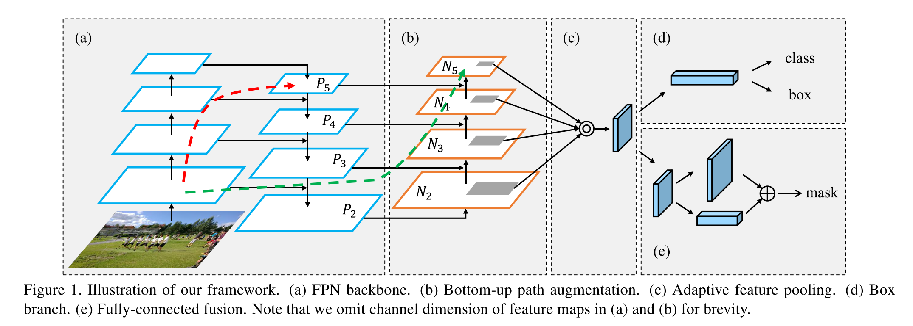

# [Path Aggregation Network for Instance Segmentation](https://arxiv.org/abs/1803.01534)

Tags: task.object_detection, task.instance_segmentation  
Date: 03/05/2018  

- The authors are motivated to build an instance segmentation framework with improved information flow
    - In Mask R-CNN, the authors note a couple of places where information propagation could be improved:
        - Features in low levels are helpful for large instance identification, but there is a long path from low-level structure to topmost features
        - Each proposal is predicted based on feature grids pooled from one feature level
        - Mask prediction is made on a single view
- The authors propose enhancing the information propagation in feature pyramid networks by adding in a bottom-up path augmentation as well as adaptive feature pooling
    - The bottom-up path augmentation is similar to the beginning top-down pathway in a feature pyramid network (which downsamples the original image while capturing features), but it takes as input the output of the bottom-up pathway from the feature pyramid network
    - The adaptive feature pooling involves several different steps:
        - Mapping each proposal to the different feature levels
        - Using ROIAlign to pool feature grids from each level
        - Fusion of the feature grids from each level using an element-wise max or sum, where this fusion is run after the pooled feature grids go through at least one parameter layer independently in each of the sub-networks (class, box, and mask)
- The authors test their method on MS COCO, Cityscapes, and MVD
    - For MS COCO, they test their method on instance segmentation as well as object detection, obtaining SOTA for both (albeit with a few more tricks that other detection frameworks use)
    - For Cityscapes, they set SOTA
    - For MVD, they also set SOTA
- Through training / experimentation, they note:
    - Nearly 70% of features for a proposal come from a feature pyramid level *other than the one the proposal was generated from*, indicating that features in multiple levels together are helpful for accurate prediction
    - Multi-scale training as well as multi-gpu synchronized batch-normalization help the network to converge better and increase the generalization ability
    - With or without adaptive feature pooling, bottom-up path augmentation consistently improves mask AP and box AP
    - With or without bottom-up path augmentation, adaptive feature pooling consistently improves performance
    - Fully-connected fusion (i.e. using fully-connected layers before and / or after the fusion in the adaptive feature pooling layer) improves mask AP
    - A heavier head for the box classification / regression sub-networks results in a noticeably higher box AP, albeit a minor improvement in mask AP
    - It is important to have at least one parameter layer that operates on the pooled features from the ROIAlign layer (without one performance degrades noticeably)

## Path Aggregation Network

## Class and BBox Sub-Network

## Mask Sub-Network

