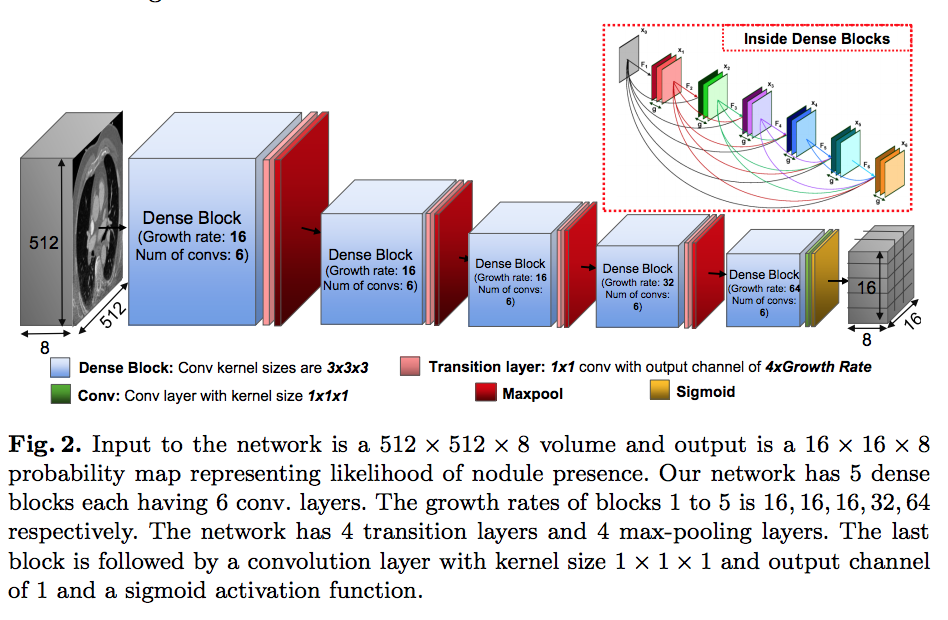
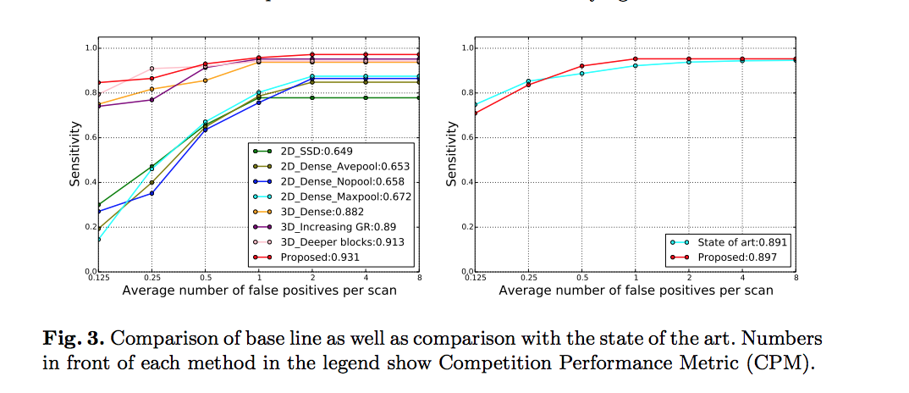

# [S4ND: Single-Shot Single-Scale Lung Nodule Detection](https://arxiv.org/abs/1805.02279)

Date: 05/06/2018  
Tags: task.object_detection, domain.medical

- The authors are motivated to develop a single 3D feed forward network for lung nodule detection, in contrast to the many multi-stage frameworks that already exist
    - Many existing methods are computationally inefficient (involving exhaustive use of sliding windows over feature maps) and are often computed in a 2D manner
    - They argue that lung nodule detection, as opposed to object detection in natural images, can be done with high accuracy using a single scale network when that network is carefully designed with its hyper-parameters
- The authors propose a single 3D convolutional network with dense connections
    - The input to the network is a 3D volume of a lung CT scan and the output is a probability map indicating the presence of a nodule in each "cell" of the lung CT (where the cells are defined by how the input volume is divided into a cell grid)
    - To define the target: 
        1. They divide the input into a grid of cells where the cell size was chosen given the expected nodule sizes.
        2. They assign each cell a label of 1 if a nodule exists in that cell and a 0 otherwise.
    - The loss function used for training is weighted cross-entroy
- The authors test their method on the LUNA challenge dataset
    - During training, they perform data augmentation by shifting the image in 4 directions by 32 pixels, with the goal of having nodules appear in random locations to avoid bias towards certain locations of nodules
    - They achieve an average FROC (over the 7 false positive operating points) of 0.897
- Through their experiments, they note: 
    - On a baseline SSD network, dense connections improve performance (marginally when using average pooling, but noticeably when using max pooling)
    - Max pooling outperforms average pooling or no pooling (at least for the SSD baseline)
    - Their 3D method significantly outperforms the baseline SSD (which is in 2D)
    - Increasing the growth rate (of the dense blocks) in the last 2 blocks of the network improved performance
    - Having deeper blocks helped information flow in the network and improved performance
    - Runtime for a whole scan varies from 11 seconds to 27 seconds (on the test set)

## Network Architecture

## FROC Performance

