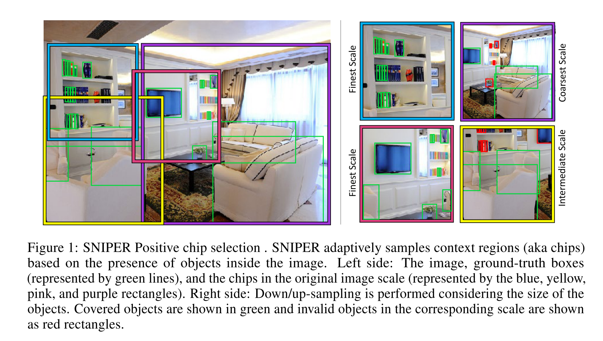
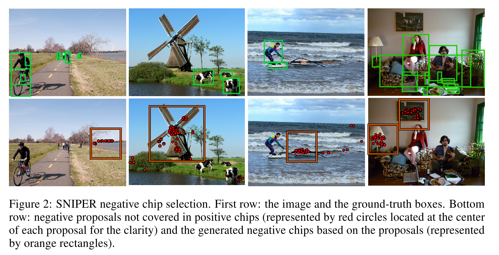

# [SNIPER: Efficient Multi-Scale Training](https://arxiv.org/abs/1805.09300)

Tags: task.object_detection  
Date: 05/23/2018

- The authors are motivated to build an object detection framework that benefits from training / testing on multiple scales, but uses much less computation
    - Using multiple scales has been shown to be highly beneficial, but requires significantly more computation (e.g. 14x when using scales=1x,2x,3x)
- The authors propose training on RoIs ("chips") that are much smaller than the image in order to save computation
    - Positive chips are sampled conditioned on the ground-truth instances and negative chips are sampled based on proposals generated by a region proposal network
        - If there were no negative chips sampled, a significant portion of the background of each image would not participate in training and the false positive rate would increase
        - At high-resolutions, SNIPER does not process most of the background
    - On average, they generate 5 chips of size 512x512 per image on COCO (including negative chips) when training on three scales
         - Because of the size of the chips they are training on, they are able to train with a batch size of 128
- They test their method on MS COCO, and achieve SOTA
- Through training / experimentation, they note:
    - Through their method, they are able to reap the benefits of multi-scale training on 3 scales, large batch size and training with batch-normalization without slowdown in performance on a single 8 GPU node
    - When training the RPN, recall does not decrease if they do not perform negative sampling (since recall does not account for false positives), so for generating proposals it is sufficient to train on just positive samples
    - The proposed negative chip mining improves average precision for all localization thresholds and object sizes
    - When dropping the number of scales that SNIPER trains on from 3 to 2 (dropping the highest resolution scale), the performance consistently drops by a large margin on all evaluation metrics

## Positive Chip Selection

## Negative Chip Selection

