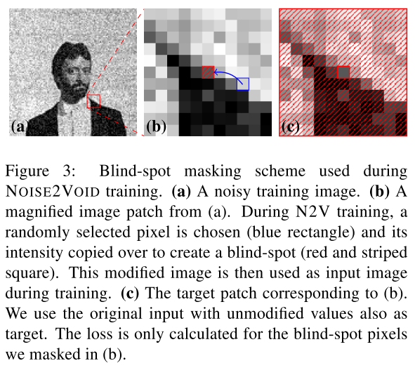
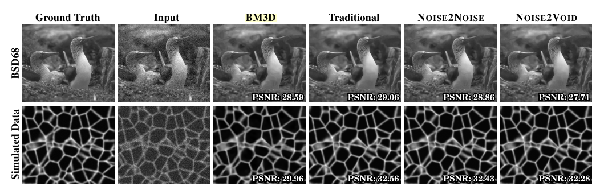
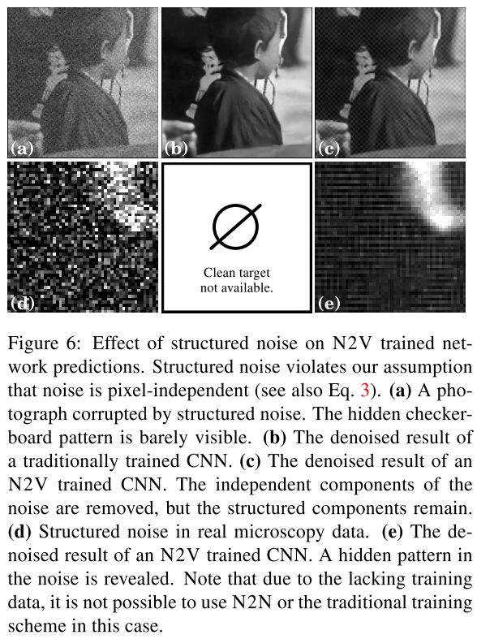

# [Noise2Void - Learning Denoising from Single Noisy Images](https://arxiv.org/abs/1811.10980)

Date: 11/27/2018  
Tags: task.image_denoising, domain.medical  

- The authors are motivated to develop an image denoising method that does not require noisy image pairs (like Noise2Noise) or clean targets (like more traditional methods)
    - The authors in particular mention biomedical image data, where the acquisition of training targets, clean or noisy, is frequently not possible
- The authors propose a method of training an image denoising network using the same noisy image as both the input and target
    - Their approach is built upon two simple statistical assumptions:
        - The signal within an image is not pixel-wise independent
        - The noise within an image is conditionally pixel-wise independent given the signal
    - They use a U-Net network, where the inputs are overlapping patches of the image to denoise, and the outputs are the same thing
        - To avoid the network simply learning the identity function, they propose a "blind-spot network", where the receptive field of each pixel excludes the pixel itself
            - In practice, they implement the blind-spot network by replacing the value in the center of each input patch with a randomly selected value from the surrounding area, effectively erasing the pixel's information
        - They train the network to minimize a pixel-wise MSE loss, and the loss is only calculated for the blind-spot pixels
    - Noisy versions of all their images were generated by adding zero mean Gaussian noise with standard deviation equal to 25
- They test their method using BSD68 data (Berkeley Segmentation Dataset and Benchmark), simulated microscopy data, and real microscopy data
    - On the BSD68 data, the traditional method performed the best in terms of the PSNR (peak signal to noise ratio), but all of the traditional, Noise2Noise, and Noise2Void methods appear visually similar, and nearly indistinguishable
        - This is the only dataset for which the Noise2Void performs worse than the training free baseline of BM3D
    - On the simulated microscopy data, both Noise2Noise and Noise2Void are nearly the same quality (visually and by the PSNR metric) as the traditional method, and all significantly outperform BM3D
    - On the real microscopy data, they find that Noise2Void and Noise2Noise perform qualitatively the same, and better than BM3D (because there is no ground truth they can't do a quantitative assessment)
- Through training / experimentation, they note:
    - The inference time of the Noise2Void method is much smaller than the BM3D
    - When there is structured noise (i.e. the assumption that the noise is pixel-independent is violated), the network can still learn to remove the independent components of the noise, but cannot learn to remove the structured components

## Blind-Spot Network

## Training Results

## Effect of Structured Noise

