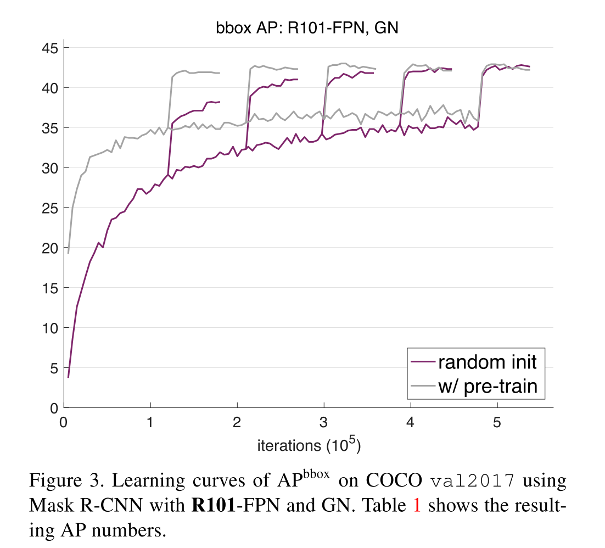

# [Rethinking ImageNet Pre-training](https://arxiv.org/abs/1811.08883v1)

Tags: task.instance_segmentation, task.keypoint_detection, task.object_detection, topic.pretraining  
Date: 11/21/2018   

- The authors question the paradigm of using pre-trained networks for object detection and instance segmentation and are motivated to train competitively performing networks from scratch
    - Although improvements have been observed when using pre-trained networks for object detection, the success of their use has shown mixed results, and sometimes small results that scale poorly with the pre-training dataset size
- The authors propose training object detection and instance segmentation networks from scratch, and focus on *unspecialized* architectures that were originally designed *without* the consideration for training from scratch
    - They aim to make minimal changes to the architectures they are using, and ultimately make only two sets of modifications:
        - Addition of normalization to help the optimization process. However, they bypass the use of standard batch normalization because of the small batch size of most detection networks. Instead, they test the use of group normalization (insensitive to batch size) as well as synchronized batch normalization (increases the effective batch size for BN calculations).
        - Longer training times, since it is unrealistic and unfair to expect models trained from random initialization to converge similarly fast as those initialized from ImageNet pre-training. Here, they aim to train the networks that don't use pre-training so that they see the same number of samples (in terms of pixels) as the networks that use pre-trained weights.
- They explore the use of the Mask R-CNN network with ResNet or ResNeXt plus Feature Pyramid Network backbones on the MS COCO detection, instance segmentation, and keypoint detection tasks
    - They find that models trained from scratch can in fact catch up in terms of accuracy to networks that are simply fine-tuned (i.e. use pre-trained weights)
    - They also find this when using VGG backbones as well, where they do not have to make any adjustments for BN (since VGG can be trained without it) and simply have to adjust the length of the training schedule
- Through training / experimentation, they note:
    - ImageNet pre-training speeds up convergence, especially early on in training, but training from random initialization can catch up after training for a duration that is roughly comparable to the total ImageNet pre-training plus fine-tuning computation. When training from scratch, they network has to learn the low-/mid-level features that are otherwise given from pre-training.
    - ImageNet pre-training does *not* automatically give better regularization, and does not necessarily help reduce overfitting unless we enter into a very small data regime (<10k COCO images or using a small dataset such as PASCAL VOC)
    - ImageNet pre-training shows no benefit when the target tasks/metrics are more sensitive to spatially well-localized predictions. The task gap between the classification-based, ImageNet-like pre-training and localization-sensitive target tasks may limit the benefits of pre-training.
    - Their study suggests that collecting data and training on the target tasks (as opposed to pre-training) is a solution worth considering, especially when there is a significant gap between the source pre-training task and the target task.
    - Models trained from scratch *can catch up* with their fine-tuning counterparts, *if* they are trained using a 5x or 6x schedule (i.e. 5x or 6x the iterations that Mask R-CNN is trained on with the 1x schedule, which uses 90k iterations)
    - Models trained from scratch and with pre-training have *similar* AP metrics under various criteria (i.e. various overlap thresholds), suggesting that the models trained from scratch catch up not only by chance for a single metric
    - The results of networks trained from scratch performing competitively to fine-tuned networks still holds when training-time scale augmentation is used, as well as when test-time augmentation is used
    - ImageNet pre-training is certainly still helpful because it can reduce the length of research cycles

## Example Results

