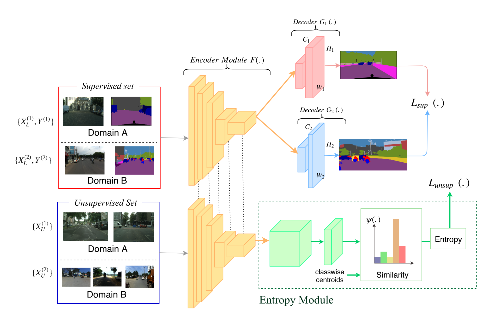

# [Universal Semi-Supervised Semantic Segmentation](https://arxiv.org/abs/1811.10323)

Date: 11/26/2018  
Tags: task.semantic_segmentation, topic.semi-supervised_learning  

- The authors are motivated to build a framework that allows for training a single model for semantic segmentation across multiple domains, and in a way that makes maximal use of unlabeled data
    - Part of the motivation for this system is to avoid the expense and redundancy of annotations, which can especially limit the quantity of labels available for training a semantic segmentation model
    - Their goal is to simultaneously limit training cost through reduced annotations and deployment cost by obtaining a single model to be used across domains
- The authors propose a single network that trains on data from different domains and minimizes supervised as well as within and cross-domain unsupervised losses
    - For the supervised component, their network structure follows the common semantic segmentation paradigm of having an encoder-decoder structure
        - To enable joint training across multiple domains, the encoder module is a shared encoder, but there are different decoders to allow for predictions in different domains
        - The supervised loss component is simply a softmax between the predicted segmentation mask and the ground truth segmentation mask
    - For the unsupervised component, they use the encoder module, which is the same encoder module used by the supervised component (i.e. there is a shared encoder module between the two), followed by an entropy module
        - The entropy module consists of two parts:
            - It projects the output of the encoder into a d-dimensional embedding space (details are a bit light, but the output looks to be the same spatial dimension as the input image, but with d channels)
            - It calculates a pixel-wise similarity score between the projected output and the d-dimensional label embeddings
                - To calculate the label embedding representation, they first train an end to end segmentation network with all the supervised training data, and then use the output of the encoder to calculate the centroid of the vector representation of all the pixels belonging to each label
                - Since the same label may present as multiple modalities (e.g. dry road, wet road, etc.), they propose using multiple centroids per label, rather than just a single one
            - The unsupervised loss consists of two components:
                - A cross dataset entropy loss that minimizes the entropy of the cross dataset similarity vectors. This makes the probability distribution peaky over a single label from the dataset, which helps to align visually similar images across datasets
                - A within dataset entropy loss that aligns the unlabeled examples within the same domain
- They test the proposed approach on Cityscapes, CamVid, IDD, and SUN RGB-D datasets
    - Using only 100 labeled examples, they demonstrate that their method outperforms the supervised only approach when combining Cityscapes and CamVid datasets, IDD and Cityscapes datasets, and Cityscapes and SUN RGB-D datasets
    - They also tested using 50 and 300 examples for Cityscapes and CamVid, as well as 300 examples for IDD and Cityscapes, and demonstrated that their method outperforms the supervised only approach as well as a finetuning approach
- Through training / experimentation, they note:
    - When testing on Cityscapes plus Camvid, using multiple centroids helps for all experiment settings irrespective of the number of labeled examples available
    - When testing on Cityscapes plus Camvid as well as IDD and Cityscapes, their model without the unsupervised loss still outperformed the purely supervised approach, as well as a finetuning approach
    - When visualizing the pixel-wise output of the encoder module using tSNE, labels of similar classes where better aligned when the encoder was trained using a universal segmentation objective

## Universal Semi-Supervised Semantic Segmentation Architecture

