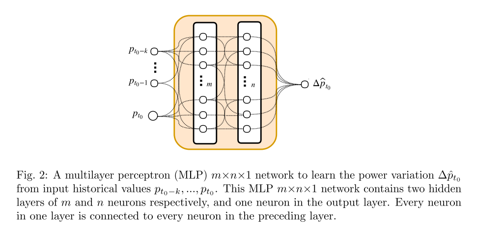
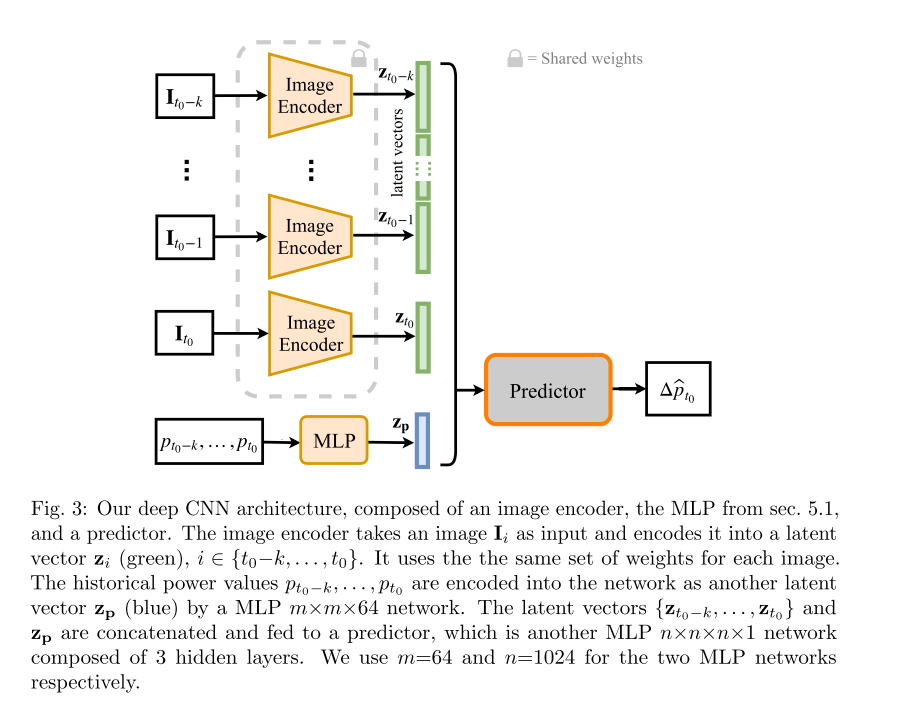
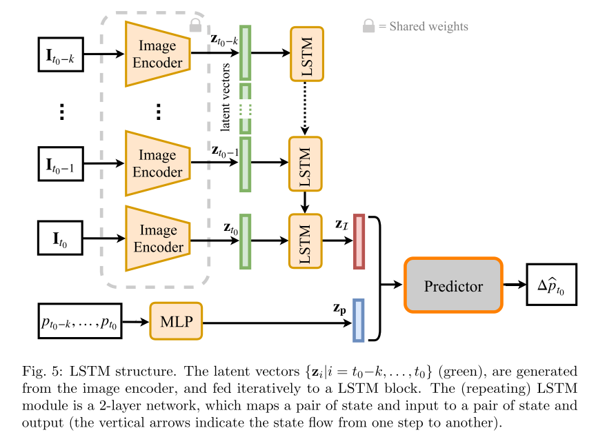

# [Deep Photovoltaic Nowcasting](https://arxiv.org/abs/1810.06327)

Tags: task.forecasting, domain.environmental  
Date: 10/18/2018

- The authors are motivated to develop a deep-learning based method for forecasting the short-term power output of a photovoltaic panel
    - In particular, they are interested in learning the relationship between sky appearance and future photovoltaic output
    - Short-term forecasting at the minute scale (i.e. *nowcasting*) is critical when managing operations of a smart grid, such as system integration, ensuring power continuity and managing ramp rates, etc.
        - Most national weather prediction and satellite data become unsuitable because of their low spatial and temporal resolution
- The authors propose three different deep learning architectures:
    - A multi-layer perceptron (MLP) that takes as input *only* historical photovoltaic power values and predicts as output the power variation between the current time step and some future time step
        - It consists of two hidden layers and is trained to minimize the L2 difference between the estimated variation and the ground truth
        - This model is used as a baseline model
    - A combo multi-layer perceptron (MLP) and convolutional neural network (CNN): The MLP takes as input the historical photovoltaic power values and the CNN takes as input the historical sky images (with the different levels of exposure stacked as channels); it predicts as output the power variation between the current time step and some future time step
        - The MLP consists of three hidden layers and the CNN consists of 5 convolutional layers and is trained to minimize the L2 difference between the estimated variation and the ground truth
    - A combo multi-layer perceptron (MLP) and a long-short term memory unit (LSTM) network that operates on the images encoded by a convolutional neural network (CNN): The MLP takes as input the historical photovoltaic power values and the LSTM takes in the encoded sky images from the CNN (with the different levels of exposure stacked as channels); it predicts as output the power variation between the current time step and some future time step
        - The MLP consists of three hidden layers, the CNN 5 convolutional layers, and the LSTM 2 layers, and is trained to minimize the L2 difference between the estimated variation and the ground truth
        - With this network, they experiment with adding a couple of additional networks & outputs to predict in order to improve performance from multi-task learning. These networks all take in the latent vectors (encoded images from the CNN) as input. The additional networks / outputs include the following:
            - The absolute power output at each timestep (regression)
            - The sun position (theta representing the 2-vector of elevation and azimuth in spherical coordinates), predicted through an added MLP
            - The entire sky image itself, predicted through an added 5-layer decoder CNN
            - The sun position variation (the difference between two sun positions)
            - The sky intensity variation 
- The authors test their architectures on self-collected data, and benchmark performance against a "persistence" model (which assumes that power will remain unchanged over the forecasting horizon). 
    - The data is collected using a camera pointed at the sky for ~1.5 years, taking pictures each second at four different exposure levels (allowing them to capture greater dynamic range than what is possible with a single image)
        - 90 days of the data was used for the experiments in the paper
        - They break apart the test set into clear, partially cloudy, and overcast days
    - All models significantly outperform the persistence model across all weather conditions
    - The CNN model outperforms the MLP, and the LSTM / CNN network outperforms the CNN and MLP networks
    - The LSTM network with multi-task learning performs similarly to the LSTM network without multi-task learning, but they do observe that the performance from the LSTM network with multi-task learning is better-balanced across the different weather conditions
- Through training / experimentation, they note:
    - Using the multiple levels of exposure helps, and shows improved performance relative to training with only a single level of exposure
    - Under clear skies, their approach still outperforms the persistence model at longer time horizons (1, 2, 5, and 10 minute horizons). As the time horizon increases, though, their performance does deteriorate. 
    - Limitations of their approach are:
        - The data only comes from one site
        - Their models have great difficulty in predicting very sharp changes in photovoltaic output, such as those created by a sudden cloud moving in front of the sun

## MLP Network

## CNN Network

## LSTM Network

