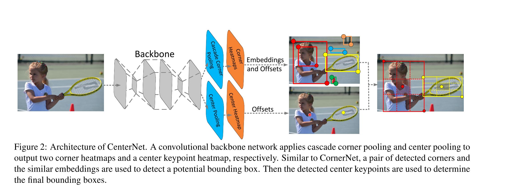
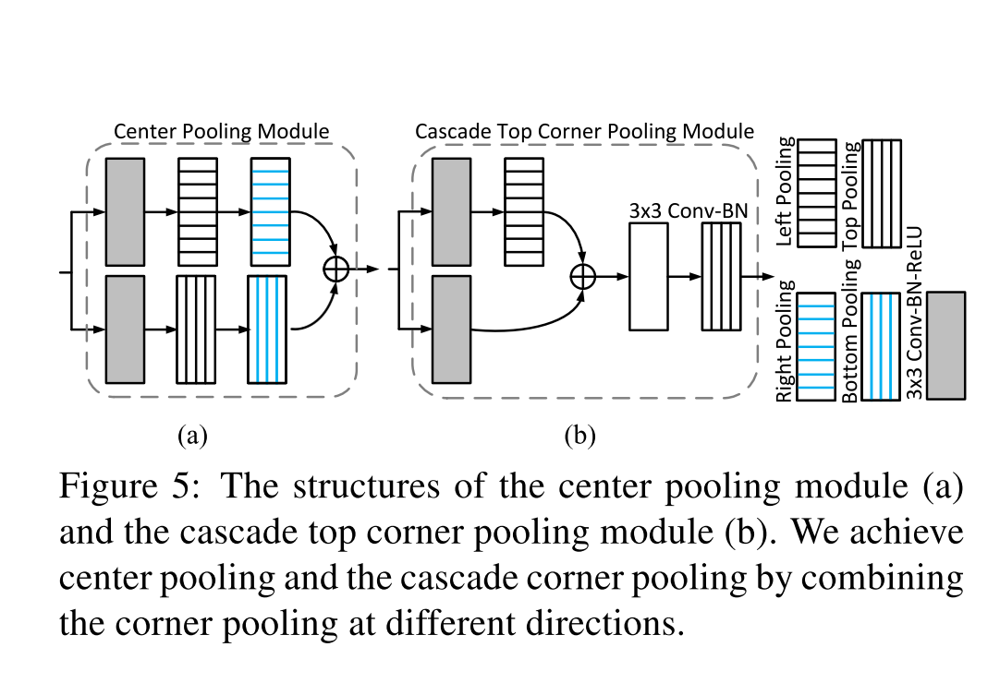

# [CenterNet: Keypoint Triplets for Object Detection](https://arxiv.org/abs/1904.08189)

Tags: task.object_detection  
Date: 04/17/2019  

- The authors are motivated to develop a one-stage keypoint-based object detection approach in which the network is able to explore the context in the center of the proposed bounding boxes
    - They are in effect motivated to overcome some of the failure modes that they have seen from CornerNet, namely that the network cannot refer to the global information of an object (i.e. look at its center context) since objects are detected as a pair of keypoints (which only see context at the corner locations)
- The authors propose a network that predicts a triplet of keypoints (a centerpoint and two cornerpoints) instead of a pair of keypoints (just cornerpoints)
    - During inference, after a proposal is generated as a pair of corner keypoints, it is determined whether the proposal is an object by checking if there is a center keypoint of the same class falling within its central region
        - Since the size of the central region in the bounding box affects the detection results, they propose a scale-aware central region to adaptively fit the size of the bounding boxes
    - The authors base their network on CornerNet, but propose two new modules:
        - Center pooling: this is used in the branch for predicting center keypoints, and is achieved by getting out the max summed response in both the horizontal and vertical directions of the center keypoint feature map
        - Cascade corner pooling: this equips the original corner pooling module (from CornerNet) with the ability of perceiving internal information, and is achieved by getting out the max summed response in both boundary and internal directions of objects on the corner keypoint feature map
- They test their method on MS COCO object detection, and obtain results that are on par (i.e. close to) SOTA
    - CenterNet outperforms all existing one-stage detectors by a large margin and ranks among the top of the state-of-the-art two stage-detectors
- Through training / experimentation, they note:
    - CornerNet has a fairly high false discovery rate, and a large part of that is incorrect bounding boxes, even at low IoU thresholds
    - Relative to CornerNet, CenterNet is quite the improvement, and the greatest contribution to that improvement is an improvement in detecting small objects
    - Relative to CornerNet, CenterNet has a much lower false discovery rate
    - Relative to CornerNet, CenterNet only takes ~13% longer to run
    - In studying the different components that they added on top of CornerNet, they find that the central region exploration is the most important (the other two are the center pooling and the cascade corner pooling)

## CenterNet

## Center Pooling and Cascase Top Corner Pooling Modules

