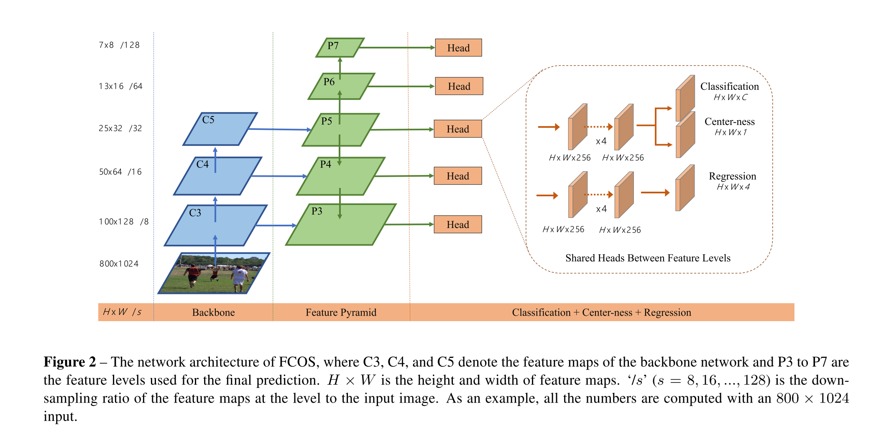
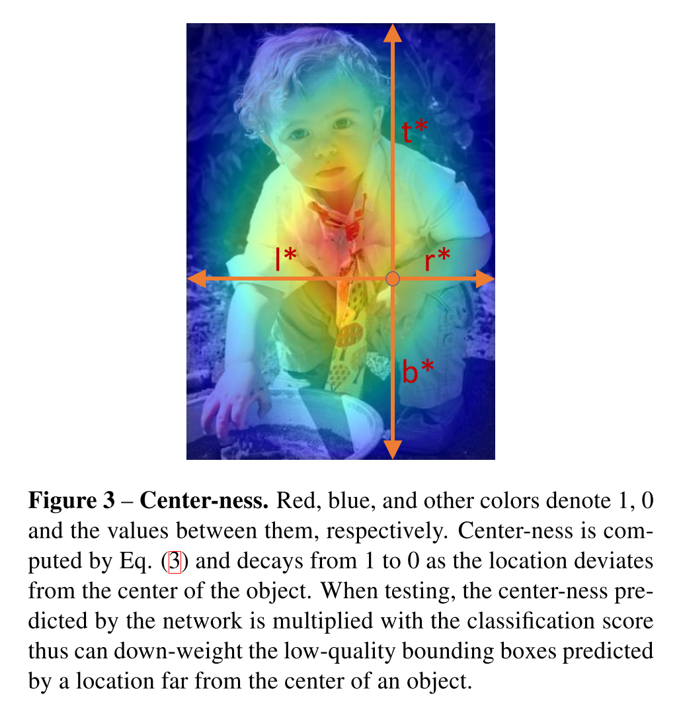

# [FCOS: Fully Convolutional One-Stage Object Detection](https://arxiv.org/abs/1904.01355v5)

Tags: task.object_detection  
Date: 04/02/2019  

- The authors are motivated to develop a fully convolutional, one-stage, anchor-free object detection method that works in a per-pixel prediction fashion, similar to many semantic segmentation networks
    - Part of their motivation is to avoid some of the drawbacks of anchor based methods:
        - Detection performance is sensitive to the size, aspect ratios, and number of anchor boxes
        - Since the scale and aspect ratios of anchor boxes are kept fixed, detectors encounter difficulties when dealing with object candidates with large shape variations, and in particular small objects
        - The pre-defined nature of anchor boxes hampers the generalization ability of detectors, since they need to be re-designed on new detection tasks with different object sizes or aspect ratios
        - In order to achieve a high recall rate, an anchor based detector is required to densely place anchor boxes on the input image
        - Anchor boxes involve complicated computations, e.g. intersection-over-union (IoU) scores with ground-truth bounding boxes
    - They are also motivated to bring object detection frameworks inline with most other image related tasks that use fully convolutional architectures (e.g. semantic segmentation, depth estimation, keypoint detection, counting).
- The authors propose a fully convolutional network that builds off of a feature pyramid backbone to predict bounding boxes and classes of objects in those boxes
    - The network has a couple of different pieces:
        - The feature pyramid backbone operates in the standard fashion of having a downsampling and upsampling path, where features from the downsampling path are fed to the upsampling path through lateral connections
        - There are shared classification, centerness, and regression heads between the different feature levels of the feature pyramid network. The classification head predicts the object in a bounding box, the centerness head predicts the deviation of a pixel to the center of its corresponding bounding box, and the regression head predicts the offsets from a pixel location to the corners of the bounding box
            - The classification layer uses C binary classifiers (i.e. C sigmoids, where C is the number of classes), instead of training a multi-class classifier (i.e. with a softmax layer)
    - The loss function they use is a combination of focal loss for the classification head, IOU loss for the regression head, and binary cross entropy loss for the centerness head
    - If a pixel location falls into multiple ground truth boxes, they assign as its target box the bounding box with minimal area
    - At test time, the final classification score for a detected bounding box is computed by multiplying the predicted centerness with the corresponding classification score, allowing for the centerness score to downweight the scores of bounding boxes far from the center of an object
- They test their method on MS COCO:
    - Their method doesn't achieve SOTA, but it does outperform RetinaNet and CornerNet, and achieves one of the highest levels of performance for single stage detectors
- Through training / experimentation, they note:
    - Their architecture has 9x fewer network output variables than anchor-based detectors that predict 9 anchor boxes per location (this fact is true of all anchorless approaches relative to anchor-based approaches)
    - Two possible issues with using a fully convolutional approach that are solved (or mostly alleviated) when using a multi-level prediction with a feature pyramid network are:
        - The large stride of the final layer in a CNN could result in a low best possible recall, since some objects will effectively disappear from the field of view due to the large stride.  They show that using multi-level predictions with a feature pyramid network results in a best possible recall that is on par with (and even slightly better than) the anchor-based detector RetinaNet
        - Overlap in ground-truth boxes can cause intractable ambiguity (i.e. which bounding box at a location should the regressor regress). Their results demonstrate that this is not much of an issue with their approach.
    - Without using the centerness branch, there are a lot of low-quality predicted bounding boxes produced by locations far away from the center of an object, ultimately resulting in the fully convolutional approach not performing as well as anchor-based approaches.
    - Using IOU thresholds in addition to centerness to suppress low-quality detected bounding boxes improves performance
    - Replacing a region proposal network with their approach yields higher recall at both the 100 and 1k proposal levels

# Network Architecture

# Centerness Calculation

