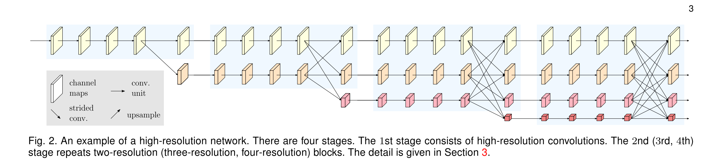
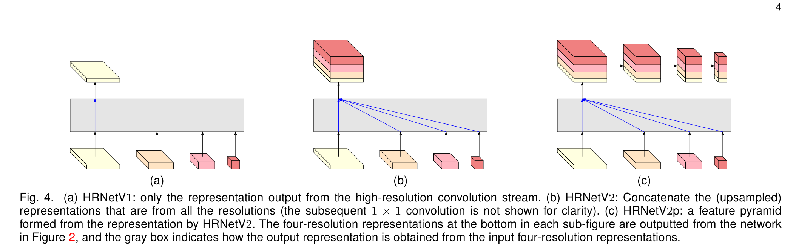

# [Deep High-Resolution Representation Learning for Visual Recognition](https://arxiv.org/abs/1908.07919)

Tags: task.instance_segmentation, task.object_detection, task.pose_estimation, task.semantic_segmentation  
Date: 08/20/2019  

- The authors are motivated to build an architecture in which high-resolution representations of the inputs can be maintained throughout the entire network
    - Most networks that use high-resolution representations end up recovering them from low-resolution representations that are often the result of successive convolutional levels that downsample the inputs
- The authors propose an architecture (High-Resolution Net, or HRNet) that starts from a high-resolution convolution stream, gradually adds high-to-low resolution convolution streams one by one, and connects the multi-resolution streams in parallel
    - The network itself has three main parts:
        - The input to their network is first put into a stem, which consists of two stride 2 3x3 convolutions that decrease the resolution to 1/4
        - The output of the stem is passed to the body, which consists of *n* different stages, where the *nth* stage contains *n* streams corresponding to *n* resolutions. In their network they use 4 stages, at resolutions 1/4, 1/8, 1/16, and 1/32.
            - Multi-resolution fusions are repeated multiple times to exchange information across the parallel streams over and over
        - The output of the body is passed to a final fusion layer, which can take one of several different forms:
            - Only the representation from the high-resolution convolution stream is returned as the output
            - The representations from all feature streams are concatenated together and returned as output (where the representations from lower resolutions are upsampled before concatenation)
            - The representations from all feature streams are concatenated together (where the representations from lower resolutions are upsampled before concatenation) and then a feature pyramid is formed from the concatenated feature streams
- They test their network on human pose estimation (using MS COCO), as well as semantic segmentation (using PASCAL-Context, Cityscapes, and LIP), object detection (using MS COCO), and instance segmentation (using MS COCO)
    - For human pose estimation, they set SOTA with a network that is more efficient in terms of model size (# parameters) and computational complexity (GFLOPs) relative to other top-performing networks
    - For semantic segmentation, they set SOTA on CityScapes, achieve competitive performance to SOTA on PASCAL-Context (they show second place results here), and set SOTA on LIP with a network that uses fewer parameters and lighter computational cost relative to other top-performing networks
    - For simultaneous object detection and instance segmentation using Mask R-CNN and some of its extended frameworks, using their network as a backbone shows mixed results (sometimes performing slightly better than ResNet based backbones and sometimes slightly worse)
    - For object detection using other networks / frameworks, using their network as a backbone generally shows better results relative to ResNet backbones
- Through training / experimentation, they note:
    - The high-resolution representations learned are semantically strong and spatially precise, which is the result of two things:
        - Their approach maintains high resolution rather than recovering it from a low resolution representation, which makes the high resolution representation more spatially precise
        - Their approach repeats multiple fusions to boost the high-resolution representations with the help of the low-resolution representations, and vice versa. This makes both the high and low representations semantically strong.
    - When using just one of the low, medium, or high resolution outputs for human pose estimation, the performance drops as the resolution gets lower, and the performance of the low resolution outputs is terrible
    - Ablation experiments show that the multi-resolution fusion unit is helpful and more fusions leads to better performance
    - Aggregating the representations from low-resolution parallel convolutions (i.e. rather than simply outputting the representation from the high resolution output stream alone) is essential for improving the performance of semantic segmentation networks
    - Results from the various datasets that they tested their network on show that it is a stronger backbone than other commonly used networks (e.g. ResNet)

## High Resolution Network

## Final Fusion Layer (Network Output)

