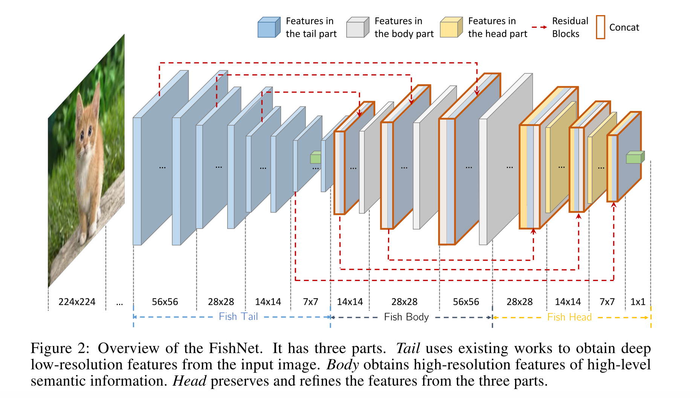
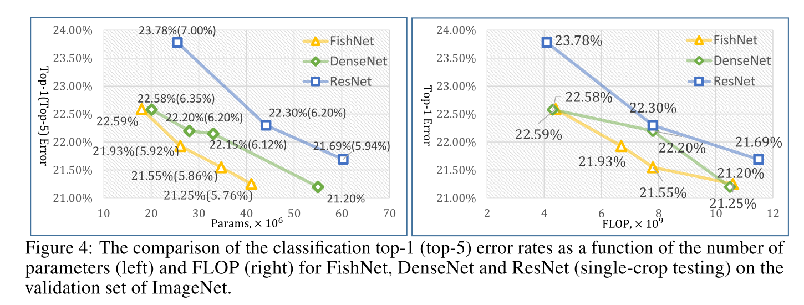

# [FishNet: A Versatile Backbone for Image, Region, and Pixel Level Prediction](https://arxiv.org/abs/1901.03495v1)

Tags: task.object_classification, task.instance_segmentation, task.object_detection  
Date: 01/11/2019  

- The authors are motivated to design a backbone structure that unifies the advantages of networks designed for pixel-level or region-level predicting tasks
    - Typically, the network structures that are used as backbones are specifically designed for image classification. Networks that perform pixel-level or region-level predicting tasks may require very deep features with high resolution, which networks designed for image classification don't readily support.
- The authors propose a network, FishNet, that preserves and refines information from all resolutions
    - The advantages of their method are:
        - It unifies the advantages of networks designed for pixel-level, region-level, and image-level tasks
        - It enables the gradient from deep layers to be *directly* propagated to shallow layers
            - Existing networks that use residual blocks without identity skip connections (i.e. the non-residual parts of the residual block) do not enable direct back-propagation
            - They use concatenation to combine features of different depths, which enables direct back-propagation throughout the entire network
        - The features of very different depth are preserved and used for refining each other
    - Their network has three parts:
        - The **tail** uses existing works (i.e. classification networks) to obtain deep low-resolution features from the input image
        - The **body** obtains high-resolution features of high-level semantic information; it consists of several up-sampling and refining blocks for refining features from the tail and the body
        - The **head** preserves and refines the features from the three parts; it consists of several down-sampling and refining blocks for preserving and refining features from the tail, body, and head
- They evaluate their method on ImageNet object classification, as well as MS COCO instance segmentation and object detection
    - On ImageNet object classification, FishNet-150 (26.4 million parameters) surpasses ResNet-50 (similar # parameters) and ResNet-101 (more parameters); it achieves a 21.93% error rate, while ResNet-50 (25.5 million parameters) achieves a 23.78% error rate and ResNet-101 (44.5 million parameters) achieves a 22.30% error rate
    - On ImageNet object classification, FishNet is able to perform as well (or better) than DenseNet, while using fewer parameters
    - On ImageNet object classification, FishNeXt-150 slighly outperforms ResNeXt-50 (21.5% error versus 22.5% error) with ~4% more parameters (26.2 million compared to 25.0 million)
    - On MS COCO object detection using feature pyramid networks (FPN), FishNet-150 obtained a 2.6% improvement in mAP relative to ResNet-50, and a 1.3% improvement in mAP relative to ResNeXt-50
    - On MS COCO object detection and instance segmentation, FishNet plugged into Mask R-CNN also yielded improvements over ResNet and ResNeXt networks
- Through training / experimentation, they note:
    - When comparing downsampling methods (convolution, max-pooling with 2x2 and 3x3 kernels, and average pooling with 2x2 kernels), they found that 2x2 max-pooling performed better than the other methods
    - When experimenting with dilated convolutions, they gave mixed results depending on what part of the FishNet the dilated convolutions were applied in

## FishNet Architecture

## FishNet Performance

