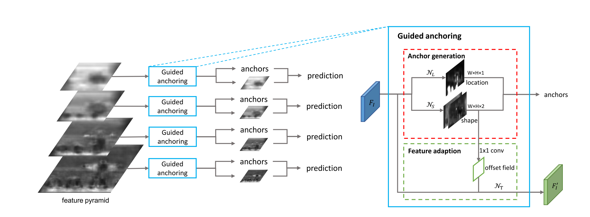
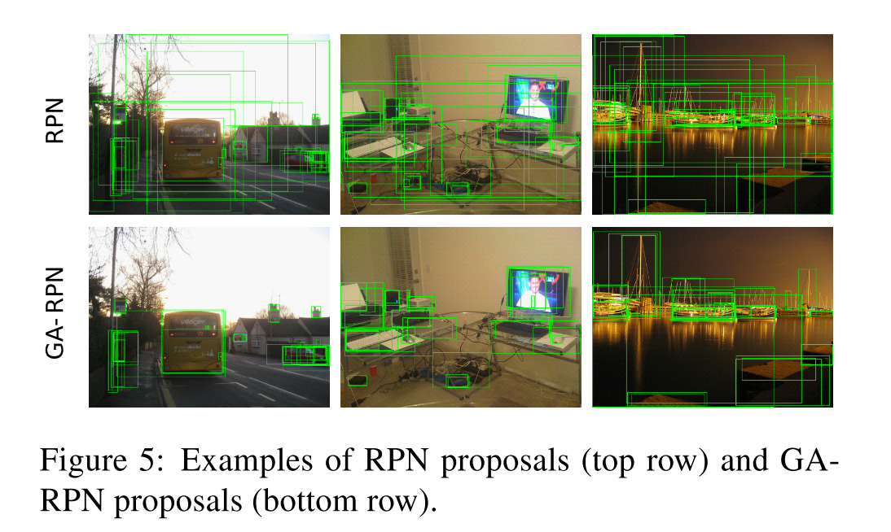
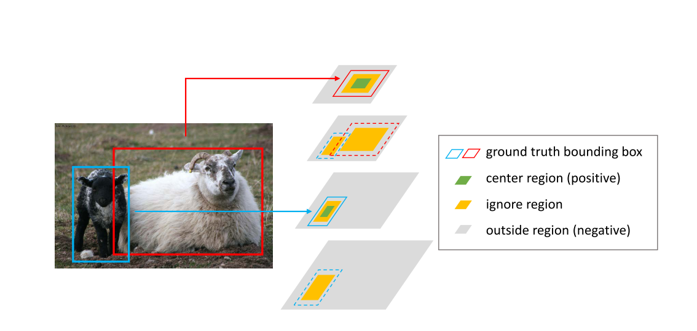

# [Region Proposal by Guided Anchoring](https://arxiv.org/abs/1901.03278v1)

Tags: task.object_detection  
Date: 01/10/2019

- The authors are motivated to generate anchors (for object detection) in a more effective and efficient way
    - State-of-the-art detectors mostly rely on dense anchoring schemes, where anchors are sampled uniformly over the spatial domain with a predefined set of scales and aspect ratios
        - In this paradigm, a new set of anchors has to be predefined for different problems, and a large number of anchors are needed to achieve high recall
        - These dense anchoring schemes are inefficient because many of the anchors are placed in regions where the objects of interest are unlikely to exist
- The authors propose a guided anchoring scheme, which leverages semantic features to guide the anchoring.
    - The scheme consists of an anchor generation module that is composed of two branches:
        - The **location prediction branch**: takes as input a feature map (derived from the input image) and outputs a probability map that indicates the possible locations of the objects
            - It outputs a probability map that is the same size as the input feature map, and where each entry's value indicates the probability of an object's center existing at that location
        - The **shape prediction branch**: takes as input a feature map (derived from the input image) and outputs location-dependent shapes
            - This branch predicts the best shape (width, height) that may lead to the highest IoU with the nearest ground truth bounding box (they use a transformation rather than predicting these directly, because they found training unstable when predicting them directly)
    - Anchors are generated by choosing the locations whose predicted probabilities are above a certain threshold and by choosing the most probable shape at each of the chosen locations
    - They also develop an **anchor-guided feature adaptation** component to transform the features at individual locations based on the underlying anchor shapes. This component is based on deformable convolutions.
    - They train a jointly optimized loss that includes the conventional classification and regression losses as well as anchor localization and anchor shape prediction losses
        - For the anchor localization loss, they define regions for each ground truth bounding box (center region, ignore region, and outside region), where each region defines whether the pixels are positive, ignore, or negative samples (center region is positive, ignore is ignore, outside region is negative)
        - For the anchor shape prediction loss, they use a bounded iou loss to maximize the IoU between the anchor and corresponding ground truth bounding box
- They test their method on MS COCO
    - Relative to an RPN baseline that adopts a dense anchoring scheme, their method achieves a 9.1% higher recall with 90% fewer anchors
    - When using their anchor generating method relative to an implementation of Fast R-CNN, Faster R-CNN, and RetinaNet without their anchor generating method, they improve mAP by 2.2%, 2.7%, and 1.2%, respectively
- Through training / experimentation, they note:
    - Relative to region proposal network proposals, there are two significant advantages to using the proposals from their method:
        - The number of positive proposals is larger
        - The ratio of high-IoU proposals is more significant
    - Their anchor generating scheme handles tall or wide objects more effectively

## Network Architecture

## Region Proposal Network Versus Guided Anchoring Scheme

## Anchor Localization Loss Regions

