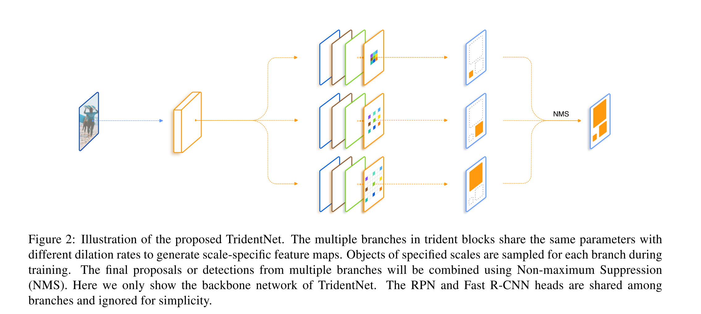
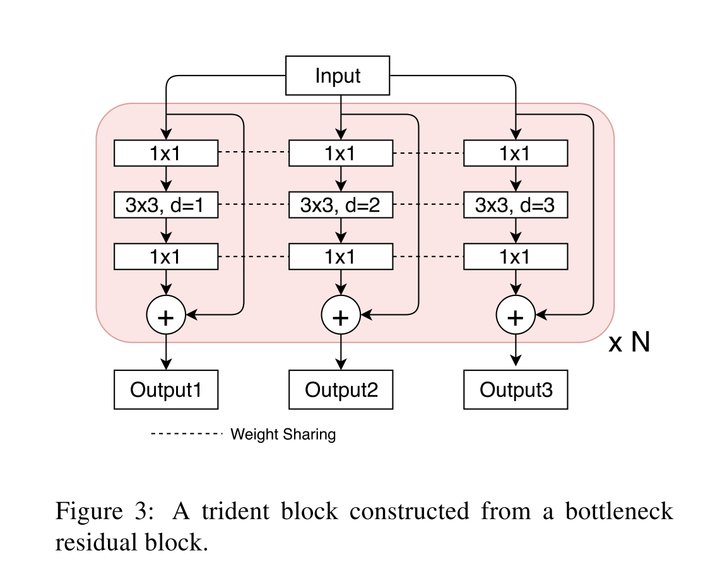

# [Scale-Aware Trident Networks for Object Detection](https://arxiv.org/abs/1901.01892)

Tags: task.object_detection   
Date: 01/07/2019

- The authors are motivated to investigate the effect of receptive fields for scale variation in object detection as well as generate an architecture that has scale-specific feature maps with uniform representational power
    - Both one-stage and two-stage object detection methods still struggle with handling objects of very different scales
    - They are aiming to get the best of the image pyramid and feature pyramid worlds. Image pyramids fully utilize the representational power of the model to transform objects of all scales equally, and feature pyramids are much more efficient
- The authors propose a network where they replace some of the convolutional blocks in the backbone network (the one used for region proposals) of a detector (one that has similar form to Faster R-CNN) with trident blocks
    - A trident block consists of multiple parallel branches in which each shares the same structure with the original block except the dilation rate
        - Each of the parallel branches in the trident block shares weights. This brings a couple of advantanges:
            - It reduces the number of parameters and makes TridentNet need no extra parameters compared with the original detector
            - It allows for objects of different scales to go through a uniform transformation with the same representational power
    - To ensure that scale mismatching (e.g. small objects on the branch with too large dilation) does not affect training, they propose a scale-aware training scheme to improve the scale awareness of every branch and avoid training objects of extreme scales on mismatched branches
        - They effectively just define a scale range for each branch, and during training only select the proposals and ground truth boxes that fall in the pre-defined scale range
    - To allow for faster inference, they propose TridentNet Fast, which only uses the middle branch of each trident block for inference
- They test their method on MS COCO object detection, and perform fairly well but not quite at SOTA
- Through training / experimentation, they note:
    - When replacing some of the standard convolutional layers in the backbone with dilated convolutional layers, the performance of the detector on small objects drops consistently as the receptive field increases (larger dilation rate). This suggests that the most suitable receptive field is strongly correlated with the scale of objects.
    - TridentNet Fast only exhibits a slight performance drop compared with the original TridentNet
    - In terms of the different components, the multi-branch structure and weight sharing account for the largest increase in performance, and the addition of scale-aware training yields marginal improvements
    - In studying the number of parallel branches to include in each trident block, they find that 2+ helps significantly, and results level off at about 3
    - In studying how many of the convolutional blocks in the backbone need to be replaced with trident blocks, they find that 10+ seems to give stable performance for TridentNet
    - They find that the branch with the smallest receptive field performs best on small objects, the branch with the medium receptive field performs best on medium objects, and the branch with the largest receptive field performs best on large objects

## TridentNet

## Trident Block

