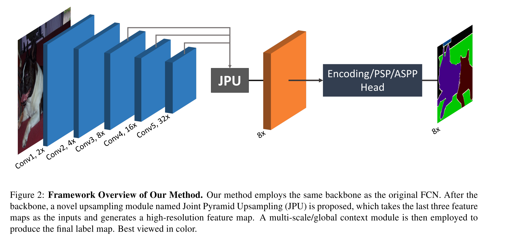
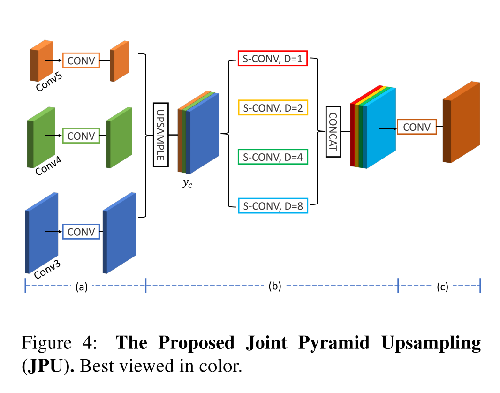

# [FastFCN: Rethinking Dilated Convolution in the Backbone for Semantic Segmentation](https://arxiv.org/abs/1903.11816v1)  

Tags: task.semantic_segmentation  
Date: 03/28/2019  

- The authors are motivated to replace the dilated convolutions that are present in many of the backbones used in semantic segmentation networks while still achieving the performance increases that dilated convolutions can bring
    - The use of dilated convolutions in the backbone networks allows for high-resolution feature extraction, but brings heavy computational complexity and memory footprint
- The authors propose a novel joint upsampling module named Joint Pyramid Upsampling (JPU) by formulating the task of extracting high-resolution feature maps into a joint upsampling problem
    - Their method consists of three main parts:
        - A backbone, where they use the original fully convolutional network, which downsamples the input image 32x (i.e. 5 convolutional levels followed by some downsampling operation)
        - The Joint Pyramid Upsampling unit takes as input the last feature map of each of the last three levels from the backbone, and consists of a number of steps:
            - Each feature map goes through a single convolution, and then are upsampled (if necessary) and concatenated
                - Its not exactly clear (at least to me), but I think the single convolutions that are used here are in part used to perform dimensionality reduction, and use fewer channels than are present in their inputs
            - Four separable convolutions with different dilation rates are employed in parallel to extract features from the concatenated feature maps in the previous step, and the outputs of each of the separable convolutions are concatenated
            - A final convolutional layer is run on top of the concatenated feature maps from the previous step in order to produce the final outputs of the joint pyramid upsampling unit
        - A multi-scale context module (e.g. a pyramid scene parsing (PSP) or atrous spatial pyramid pooling (ASPP) module) employed to produce the final predictions
- They test their method on PASCAL context as well as ADE20K, and they achieve SOTA on both
- Through training / experimentation, they note:
    - With their proposed joint pyramid upsampling, they are able to reduce computational complexity by more than three times without performance loss
    - The joint pyramid upsampling unit can be formulated as a joint upsampling problem in which the feature map from the 4th convolutional stage is upsampled based on the feature map from the 3rd convolutional stage, and the same thing for upsampling the feature map from the 5th convolutional stage using the enlarged feature map from the 4th convolutional stage
    - The joint pyramid upsampling unit outperforms a feature pyramid network when it is used as an upsampling method
    - Compared to encoding net (EncNet), their method runs about two times faster when using ResNet-50 as the backbone and more than three times faster when using ResNet-101 as the backbone
    - In terms of speed, their method is comparable to using a feature pyramid network

## FastFCN Architecture

## Joint Pyramid Upsampling Unit

