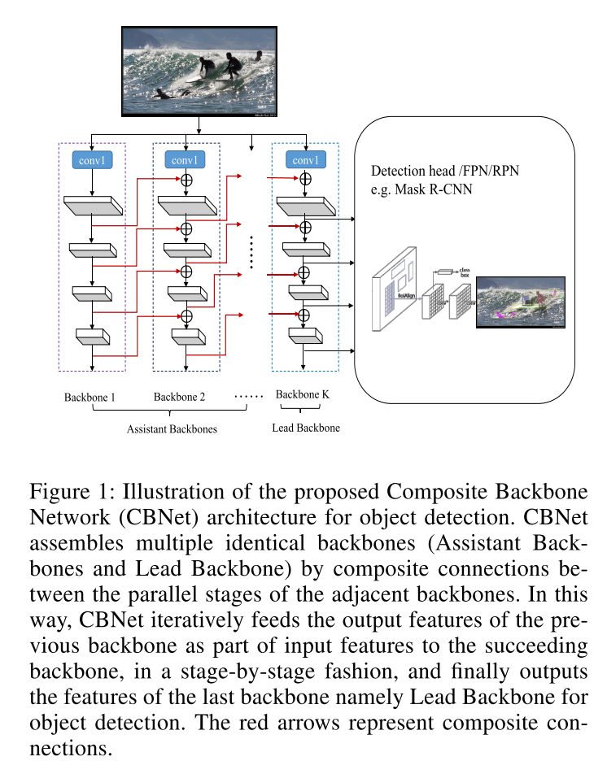
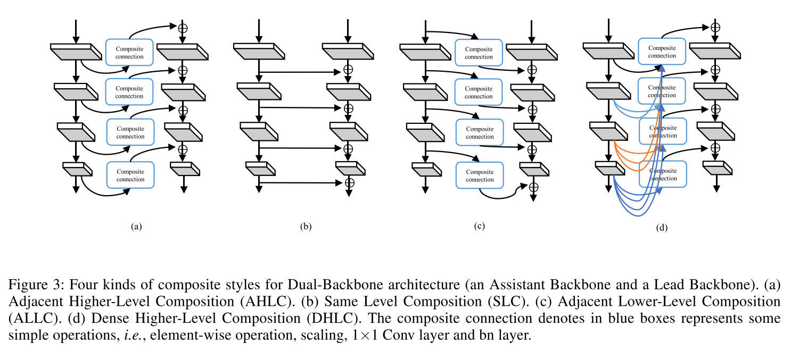

# [CBNet: A Novel Composite Backbone Network Architecture for Object Detection](https://arxiv.org/abs/1909.03625v1)

Tags: task.instance_segmentation, task.object_detection  
Date: 11/09/2019  

- The authors are motivated to achieve better object detection performance by building a more powerful backbone from existing backbones (e.g. ResNet and ResNeXt)
    - By building a more powerful backbone using existing backbones, they are able to avoid the expensive process of designing a novel backbone 
- The authors propose building a *Composite Backbone* (CBNet) by assembling multiple identical backbones using composite connections between adjacent backbones
    - The architecture consists of K identical backbones, where the first K-1 backbones are referred to as the Assistant Backbones and the final backbone is referred to as the Lead Backbone, which is the one whose feature maps are used for object detection
    - The output features of each backbone are successively fed as part of the input features to the succeeding backbone, in a stage-by-stage fashion. This particular formulation is referred to as Adjacent Higher Level Composition (AHLC), but they do play with other possible composite styles.
- They test their method on object detection and instance segmentation with MSCOCO using several detection frameworks, namely Feature Pyramid Networks (FPN), Mask R-CNN, and Cascade R-CNN
    - They find that their proposed method improves the mAPs of both object detection and instance segmentation of each framework by 1.5 to 3 percent (depending on whether they use 2 or 3 assistant backbones)
    - They achieve SOTA on MS COCO object detection using a Cascade Mask R-CNN baseline and their proposed CBNet
- Through training / experimentation, they note:
    - The Adjacent Higher Level Composition composite style gives the best performance compared to others
    - When sharing weights of backbones in CBNet, the detection result is still much better than the baseline, but when not sharing weights the detection results are even better (although there is not as big of a jump from the baseline to the shared weight CBNet)
    - Detection performance (in terms of mAP) steadily increases with the number of assistant backbones, but tends to converge when the number of backbones reaches three
    - The feature maps extracted from their CBNet have stronger activation values at the foreground object and weaker activation values at the background object relative to baseline networks

## CBNet Architecture

## CBNet Composition Styles

