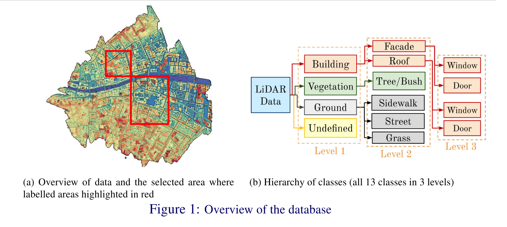
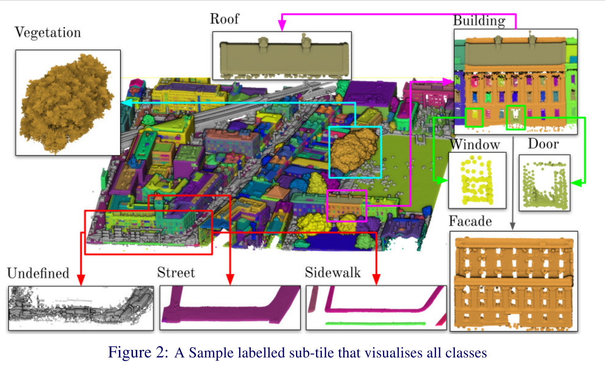
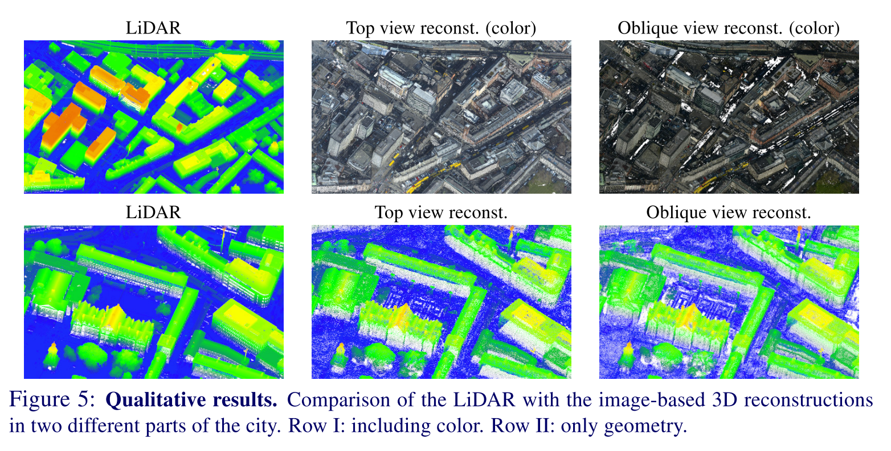

# [DublinCity: Annotated LiDAR Point Cloud and its Applications](https://arxiv.org/abs/1909.03613)

Tags: task.image_reconstruction, task.3D_object_classification
Date: 11/06/2019  

- The authors are motivated to present the first-ever labelled dataset for a highly dense Aerial Laser Scanning (ALS) point cloud at city-scale, and to validate the dataset by showcasing two different applications of it
- The authors introduce annotations for an aerial LiDAR dataset that was collected of Dublin city
    - The dataset was manually annotated, and consists of over 1.4 billion laser scanning points, of which 260 million are labelled into 13 classes with hierarchical levels
    - The area of Dublin city that is labelled includes diverse types of historic and modern urban elements, and the types of buildings include offices, shops, libraries, and residential houses
    - There are three levels of labelling:
        - Level 1: A course labelling that includes four classes - building, ground, vegetation, and undefined
        - Level 2: A more fine-grained level of labelling in which the first three categories of Level 1 are divided into a series of refined classes. Building is divided into roof and facade, vegetation is divided into separate plants (e.g. trees and bushes), and ground points are split into street, sidewalk, and grass.
        - Level 3: The finest level of labelling, which just consists of any types of doors and windows on roofs or facades.
    - The LiDAR dataset also comes with two types of aerial imagery data that was collected alongside of the LiDAR data
- The authors validate the dataset using 3D point cloud object classification as well as image-based 3D reconstruction
    - For 3D point cloud object classification, the authors train PointNet, PointNet++, and SO-Net, finding that SO-Net performs the best across varying levels of training using different numbers of points per object
    - For image-based 3D reconstruction, they used open-source software COLMAP

## Overview of Dublin City database

## 3D Object Classification

## Image-Based 3D Reconstruction

